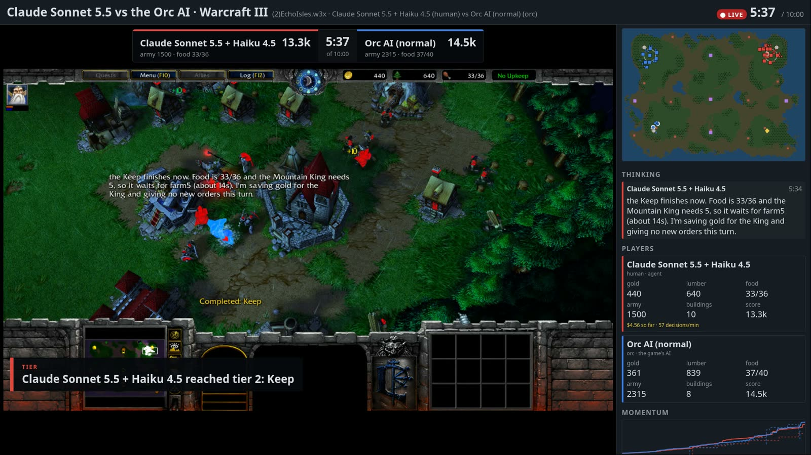
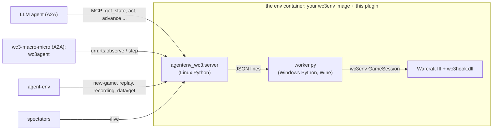

# Warcraft III for AgentEnv

[](LICENSE)
[](https://www.agentenvframework.com)

AI agents play Warcraft III: The Frozen Throne through [wc3env](https://github.com/pwang724/wc3env).
- **Who they play:** the game's own AI, each other (model against model), as a team, in a free-for-all, or in short
  drills.
- **Who can play:**
  - any chat model, through MCP tools (`wc3-llm`);
  - wc3env's own two-model agent, `wc3agent`, in which a macro model plans and a fast micro model controls each unit;
  - a scripted opponent.
- **How you set it up:** one task JSON says who plays, on which map, with which races and teams, how the game starts,
  what is staged first and how it is graded, all without code.

Every game is graded, saved as a native `.w3g` replay and recorded. You can watch it live in the game's own picture,
with the agents' plans beside it, and send it to Twitch or X with two AI casters calling it.

This repository is an environment plugin for the [AgentEnv Framework](https://www.agentenvframework.com). Its
RTS-generic half, `agentenv_rts`, is meant for the next real-time strategy game too.

[](docs/media/broadcast-clip.mp4)

*▶ [Watch 45 seconds of the broadcast](docs/media/broadcast-clip.mp4), with sound: Claude Sonnet 5.5 (macro) and
Haiku 4.5 (micro) reach tier 2 against the normal Orc AI in `macro-micro-realtime`, while the casters, Max and Ada,
call it. Claude won on score at the 10-minute limit, 30.7k to 28.5k, after killing the Orc's Blademaster four times.*

> **Unofficial, offline, and bring your own game.** This project is not affiliated with or endorsed by Blizzard
> Entertainment; Warcraft is their trademark. It contains no game files: wc3env runs your own licensed Warcraft III
> Legacy (1.29.2) installation, offline only, never on Battle.net. The env image you build holds your game files:
> keep it private. Whether this use fits your license agreement is your responsibility.

**Status:** played on the real game (Warcraft III Legacy 1.29.2 under Wine, x86-64 Linux, Docker).
- **Tasks that ran there:**
  - `smoke`;
  - a chat model through the MCP tools against the AI (`vs-ai-quick`);
  - wc3agent against the AI, stepped and in realtime, streamed with its casters;
  - two agents in a lockstep duel;
  - drills;
  - a sweep of four models × two maps × three seeds ([first-eval](docs/evals/first-eval.md), $4.24).

  The [Tasks](#tasks) table has times, costs and grades.
- **Multiplayer rules, checked there with no model:**
  - a team wins together;
  - a free-for-all plays to the last seat;
  - a fixed seed replays a game step for step;
  - no game starts until every player has made its first move.
- **Chaos-tested there**, by breaking things on purpose mid-game:
  - **An agent's container killed:** the others play on without it.
  - **The game process killed:** every seat is told the game failed.
  - **The broadcast's container killed:** the game is still played, graded and recorded.
  - **Activation-file secrets corrupted or missing:** refused, with a clear error.
  - **Path traversal on recordings, bogus seats, and invalid holds and finishes:** refused.
  - **Two tasks at once:** both pass.

Everything above the game also runs on wc3env's **fake game**, on macOS (Apple Silicon) and Linux, without
Warcraft III.

## Before you start

- **Python 3.11+ and [uv](https://docs.astral.sh/uv/).**
- **Docker**, and the local image registry agent-env stores images in:
  `docker run -d -p 5000:5000 --restart unless-stopped --name registry registry:2`.
- **A model endpoint** for the agents (and the casters): any OpenAI-compatible endpoint that serves model names like
  `anthropic/claude-haiku-4-5`, such as a [LiteLLM](https://docs.litellm.ai/) proxy. Give it to agent-env either way:

  ```bash
  export LITELLM_BASE_URL=https://your-endpoint.example.com LITELLM_API_KEY=...   # or, in .agentenv/config.toml:
  # [model]
  # base_url = "https://your-endpoint.example.com"
  # api_key = "env:LITELLM_API_KEY"       # a reference: secrets never go in the file
  ```

```bash
git clone https://github.com/earakely-scale/agentenv-wc3-plugin && cd agentenv-wc3-plugin
uv tool install agentenv-framework --with-editable .
agent-env config show                       # which config and model endpoint agent-env uses
```

## Try it without Warcraft III (Mac or Linux, 10 minutes)

wc3env's fake game is a stand-in world (a town hall, five peasants and a distant enemy hall; units move and stop,
nothing else), so every task runs end to end without the game:

```bash
agent-env wc3 setup --fake --agent          # the env on the fake game, and the agents (wc3-llm, wc3-macro-micro, wc3-scripted)
agent-env run wc3 --task smoke               # no model: the game runs, is graded and recorded (~1 min, $0)
agent-env run wc3 --task macro-micro-quick   # wc3agent, Haiku for macro and micro: 5 game minutes (~8 min, ~$1.20)
agent-env wc3 watch --open                   # while a game runs: its live view
agent-env wc3 recordings --out match         # afterwards: the run's recording and replay, in ./match
```

## Play the real game (x86-64 Linux)

The game runs under Wine in Docker, on an **x86-64 Linux host** (a laptop, a server or a cloud VM). Apple Silicon and
other arm64 machines can't run it; drive a Linux host from them instead. Getting the game files ready takes one pass
on a Windows machine, about an hour, once.

**1. Get the game.** Buy Warcraft III: Reforged on Battle.net (it includes the classic game). In the Battle.net app,
open the Warcraft III page, choose **Warcraft III - Legacy TFT 1.29** in the Game Version dropdown, and install it.
That is the one build wc3env supports (`1.29.2.9232`, checked by its executable's hash), and installing it also puts
the activation files `roc.w3k` and `tft.w3k` in its folder.

**2. Prepare the game files (once, on Windows x64).** Any Windows machine works, including a cloud Windows VM. Install
64-bit Python 3.11+ and Visual Studio Build Tools 2022 with "Desktop development with C++", then, in wc3env at the
commit this plugin pins
([`eb660aa`](https://github.com/pwang724/wc3env/tree/eb660aa558fb6e5c639a1ff404082f7dc0ee483e)):

```powershell
git apply path\to\agentenv-wc3-plugin\patches\wc3env-realtime-hold.patch   # optional, see below
wc3hook\build.bat                                   # builds and tests the injected hook
python docker\prepare.py --game-dir "C:\Program Files (x86)\Warcraft III (Legacy)" --output build\docker-context
```

The patch lets a realtime game wait at its start until every player has made its first move (the hook's `hold` and
`release`). Without it, a realtime game starts when it is created; stepping games wait either way.

`prepare.py` checks the executable's hash and copies only the game files and stock maps the worker needs, never the
activation files (see wc3env's [docker/README.md](https://github.com/pwang724/wc3env/blob/main/docker/README.md)).

**3. Build the worker image (on the Linux host).** Copy `build\docker-context` there, and the two activation files into
`~/.wc3-license`:

```bash
chmod -R a+rX docker-context                 # the image's build runs as a non-root user, which must read it
docker build --platform linux/amd64 --target environment -t wc3-worker:local docker-context
mkdir -p ~/.wc3-license && cp roc.w3k tft.w3k ~/.wc3-license/ && chmod 600 ~/.wc3-license/*
agent-env wc3 license import ~/.wc3-license  # into agent-env's secret store, so a run on any machine finds them
```

**How the activation files reach the game:**
- **Never in an image.** The `wc3_match` step sends them to the env when a game starts.
- **From agent-env's secret store first.** They're the secrets `WC3_ROC_W3K` and `WC3_TFT_W3K`, each file in base64.
  `license import` writes them into a local secrets file. For a cloud store (AWS or GCP), store them there yourself.
- **Then from a folder on the machine running the task:** `license_dir` in `[plugins.agentenv-wc3]`,
  `$WC3_LICENSE_DIR` or `~/.wc3-license`.
- **To check:** `agent-env wc3 license show` says where they come from, never what they contain.

**4. Play.**

```bash
agent-env wc3 check                          # the host, your worker image, your activation files
agent-env wc3 setup --agent                  # the env on top of wc3-worker:local, as "wc3", and the agents
agent-env run wc3 --task smoke               # ~1 min: the game starts, runs two minutes, is graded and recorded
agent-env run wc3 --task vs-ai-quick         # Haiku 4.5 plays through the MCP tools against the easy Orc AI
agent-env run wc3 --task macro-micro-realtime   # Sonnet 5.5 + Haiku 4.5 against the normal Orc AI, 10 min, ~$11
agent-env wc3 recordings --out match         # its video, highlights, HTML replay and .w3g, in ./match
```

**Disk:** each `setup` stores the env image, about 2.6 GB with the game, as a new version in agent-env's object
store (`~/.local/state/agent-env/object_store/artifacts/docker_image/mcp-server-wc3/<version>`). Old versions stay
until you delete them; keep the one your env is registered at.

**Watch from your laptop:** the env listens on the host's loopback. `agent-env wc3 watch` on the host prints its
address; forward it with `ssh -L 8080:127.0.0.1:<port> <host>` and open `http://localhost:8080/live`.

## Record a broadcast, or stream it

A broadcast shows the game's picture with a score bug, the agents' plans, the feed and two AI casters, voiced and
captioned. There are two ways to make one.

**In the task: the `rts_broadcast` step.** It starts with the env, beside the agents and the match. It holds the
game's start until the stream is live, so the broadcast has the game from its first move. It records the game (and
streams it, with `to`), and stores the video as an artifact of the run:

```json
{"id": "broadcast", "type": "rts_broadcast", "env_id": "wc3", "to": ["twitch"], "title": "Sonnet vs the Orc AI",
 "depends_on": ["deploy"]}
```

- **When it ends:** after GAME OVER. It also ends if the game clock stands still for `stall_seconds` (a run whose play
  failed) or if the run is cancelled, so it never holds a run open.
- **If it fails,** the run goes on, and the error is noted in the run's `broadcast_errors`, unless the step sets
  `fail_task_on_error`. If the streamer dies mid-game, the video it had recorded so far is kept.
- **An example:** `broadcast-smoke` records two scripted players, at no model cost.

**Beside any run: `agent-env wc3 stream`.** It waits for the game and stops after GAME OVER:

```bash
agent-env wc3 stream --offline --record broadcasts &   # records broadcasts/stream-<time>.mp4: no stream key needed
agent-env run wc3 --task macro-micro-realtime
```

To go out live, give a stream key: `to` in the step, or `--to twitch`, `--to x` or both on the command (details in
[Stream it to Twitch or X](#stream-it-to-twitch-or-x)). The casters cost about $2 a game on Haiku 4.5.

## Tasks

| Task | Who plays | Game | Measured on the real game |
|---|---|---|---|
| `smoke` | nobody: the harness lets the game run | 2 minutes | 40 s, $0 |
| `broadcast-smoke` | two `wc3-scripted` seats (attack and raid), staged armies, a recorded broadcast | 2 minutes, stepped in lockstep, graded per seat | 2 min, $0; red 0.25, blue 0.43, the same both times it ran; a 1080p broadcast of 105 s |
| `vs-ai-quick` | `wc3-llm`: Haiku 4.5 through the MCP tools, Human | 5 minutes against the easy Orc AI | 3 min, $0.10 (52 model turns, prompt-cached); 0.42: survived to the limit, outscored 8.7k to 4.8k. In `first-eval`, 6 games: 0.44 ± 0.01, $0.14 a game |
| `vs-ai` | `wc3-llm`: Sonnet 5.5 through the MCP tools, Human | 20 minutes against the normal Orc AI | not yet measured |
| `macro-micro-quick` | wc3agent: Haiku 4.5 macro, Haiku 4.5 micro | 5 minutes against the easy AI, stepped | ~10 min, $2.40 |
| `macro-micro` | wc3agent: Sonnet 5.5 macro, Haiku 4.5 micro | 20 minutes against the normal AI, stepped | not yet measured |
| `macro-micro-realtime` | wc3agent: Sonnet 5.5 macro, Haiku 4.5 micro | 10 minutes against the normal AI, in realtime, with the game's picture | 11 min, ~$11 |
| `duel-quick` | two wc3agents, Haiku 4.5 for both models, Human against Orc | 5 minutes, stepped in lockstep, graded per seat (`dense`) | 19 min, $4.70; Orc 0.41, Human 0.35 |
| `drill-*` (25) | wc3agent with Haiku 4.5, against the AI or the scripted `wc3-scripted` | wc3agent's 25 scenarios as drills: 1.5 to 10 minutes, graded by their checks | `drill-fight-even` 11 min, $2.30, 0.6; `drill-creep-easy` 10 min, $1.90, 0.67 |

`agent-env run wc3 --task <task>` runs one; the costs are model spend at list prices. On the fake game,
`macro-micro-quick` costs about $1.20 (there is nothing to fight, so the micro model is never asked).

- **Map and side:** the bundled tasks are all on Echo Isles, seed 1, with the agent playing Human (Orc too in
  `duel-quick`). Any stock map, race, seed and mix of players is a few lines of JSON away:
  [Write your own task](#write-your-own-task).
- **Drills:** each stages its start (`urn:wc3:stage/v1`) and is graded by its checks. The bundle's
  [README](src/agentenv_wc3/bundles/wc3/README.md) lists the 25 drills; [docs/task-design.md](docs/task-design.md) is
  the design.
- **What every task saves:** the game's native replay and the spectator recording, as file artifacts. The recording
  is an MP4 of the map, a self-contained HTML replay, and the timeline as JSON: every frame's units, events and notes,
  to recut or analyse a game without playing it again. `macro-micro-realtime` also saves the game's own video, with a
  chapter at each major moment, and a highlight reel of at most two minutes cut from it; its HTML replay plays the
  video beside the map when both files are in one folder.
- **Grading:** `rts_grade` grades each agent seat. The full games use the `melee` rubric:
  - a win counts three times as much as not being defeated or as outscoring the opponent;
  - an undecided game at the time limit is a draw, so outscoring the opponent earns its part, but a win needs every
    enemy building destroyed;
  - the grade is 0 if the game stopped working, if the agent gave no orders, or if the harness played part of the
    game.

  `duel-quick` adds army, kills, buildings, tier, expansions and hero level (`dense`); drills use their own checks.

## Write your own task

A task is a JSON list of steps, run as a DAG (a step without `depends_on` waits for every step before it). A WC3 task
is built from a few steps:

| Step | What it does |
|---|---|
| `deploy_env` | Starts the env registered as `wc3` |
| `deploy_agent` | Starts an agent: `wc3-llm`, `wc3-macro-micro`, `wc3-scripted` or any A2A agent that takes an MCP server. An agent that plays a seat deploys with `"env_ids": []` |
| `rts_seat_agents` | Gives each named agent its seat's address, `<env>/seats/<agent>/mcp`. It needs only the env and the agents, not the game |
| `wc3_match` | Creates the game: map, seed, time limit, clock, and the seats (who plays) |
| `apply_server_config` with `urn:wc3:stage/v1` | Optional: stages the board before play (units, levels, items, resources, a paused AI) |
| `prompt_agent` | One per agent: the prompt, and the model it plays on. It lasts the whole game |
| `rts_broadcast` | Optional, from the env's deploy on: holds the game's start until it is live, then streams or records the game, with casters |
| `rts_finish` | After every play step: settles a game its agents stopped before its end (`play_out`, `forfeit` or `as_is`) |
| `rts_grade` | Grades each agent seat with a rubric, weights, targets and checks |
| `save_wc3_replay`, `save_rts_recording` | The `.w3g`, and the recording (map MP4, HTML replay, timeline JSON, the game's video, highlights) |

A game with seats runs as this DAG:

```
deploy ─┬─► agents ─► rts_seat_agents ──────┐
        ├─► wc3_match ─► stage ─────────────┴─► play (one per agent) ─► rts_finish ─► rts_grade ─► replay, recording
        └─► rts_broadcast (optional: holds the start until it is live, ends after GAME OVER)
```

**When the game starts:** `wc3_match` only creates the game, with its clock stopped. Each agent's first move is its
"ready", and the game starts once every agent has made one, carrying out all their opening orders. Until then
`get_state` says so and the live page shows "Waiting for …". An agent that never moves stops holding the start after
`lockstep.stall_seconds`. In `stepping` mode time then passes only as the agents step, and several agents move in
lockstep. In `realtime` mode the game runs on its own clock. Holding a realtime game at its start needs the hook patch
from step 2 of [Play the real game](#play-the-real-game-x86-64-linux).

### Model against model, with different kinds of agent

Claude Sonnet plays through the tools, against wc3agent on Haiku, in one game, broadcast with its casters. This is
an example; the bundled agent-against-agent task is `duel-quick`:

```json
[
  {"id": "deploy", "type": "deploy_env", "env_id": "wc3"},
  {"id": "agent-a", "type": "deploy_agent", "agent_name": "sonnet", "a2a_agent_id": "wc3-llm", "env_ids": [],
   "depends_on": ["deploy"]},
  {"id": "agent-b", "type": "deploy_agent", "agent_name": "bot", "a2a_agent_id": "wc3-macro-micro", "env_ids": [],
   "env_vars": {"WC3_MICRO_MODEL": "anthropic/claude-haiku-4-5"}, "depends_on": ["deploy"]},
  {"id": "seat", "type": "rts_seat_agents", "env_id": "wc3", "agents": ["sonnet", "bot"],
   "depends_on": ["agent-a", "agent-b"]},
  {"id": "match", "type": "wc3_match", "env_id": "wc3", "map": "(2)EchoIsles.w3x", "seed": 7,
   "time_limit_seconds": 900, "seats": [{"agent": "sonnet", "race": "human"}, {"agent": "bot", "race": "orc"}],
   "depends_on": ["deploy"]},
  {"id": "broadcast", "type": "rts_broadcast", "env_id": "wc3", "title": "Sonnet vs wc3agent", "depends_on": ["deploy"]},
  {"id": "play-a", "type": "prompt_agent", "agent_name": "sonnet", "model": "anthropic/claude-sonnet-5-5",
   "prompt_id": "duel-a", "prompt": "Win this game of Warcraft III.", "depends_on": ["match", "seat"]},
  {"id": "play-b", "type": "prompt_agent", "agent_name": "bot", "model": "anthropic/claude-haiku-4-5",
   "prompt_id": "duel-b", "prompt": "Play the game the env has started to its end.", "depends_on": ["match", "seat"]},
  {"id": "finish", "type": "rts_finish", "env_id": "wc3", "rule": "forfeit", "depends_on": ["play-a", "play-b"]},
  {"id": "grade", "type": "rts_grade", "env_id": "wc3", "rubric": "dense", "depends_on": ["finish"]},
  {"id": "recording", "type": "save_rts_recording", "env_id": "wc3", "depends_on": ["grade"]}
]
```

Here an agent that stops before the end forfeits: `rts_finish` with `rule: forfeit` gives it the defeat, and the
team rule gives its opponents the win.

### Teams, allies and free-for-all

Only `seats` changes (and `map`: one with as many start locations as seats). Seats on one team are allies (passive
to each other, sharing vision) and win together. A seat without a `team` is its own team, so a list of bare seats is a
free-for-all:

```jsonc
// two agents against two AIs, on (4)TurtleRock.w3x
"seats": [{"agent": "p1", "race": "human", "team": 1}, {"agent": "p2", "race": "night_elf", "team": 1},
          {"computer": "normal", "race": "orc", "team": 2}, {"computer": "normal", "race": "undead", "team": 2}]
// an agent with an AI ally, against an AI (a 4-player map)
"seats": [{"agent": "p1", "race": "orc", "team": 1}, {"computer": "easy", "race": "human", "team": 1},
          {"computer": "easy", "race": "undead", "team": 2}]
// three agents, free for all: the game plays on until one is left
"seats": [{"agent": "a", "race": "human"}, {"agent": "b", "race": "orc"}, {"agent": "c", "race": "undead"}]
```

### A drill: stage the board, grade on checks

A stage step puts units at named places, relative to the first agent's start, and names them for the grade:

```json
{"id": "stage", "type": "apply_server_config", "env_id": "wc3", "depends_on": ["match"],
 "directives": [{"service": "wc3", "uri": "urn:wc3:stage/v1", "args": {"ops": [
   {"op": "spawn", "player": "wc3", "type": "Hamg", "at": "home", "dx": -1300, "as": "hero"},
   {"op": "level", "unit": "hero", "level": 3},
   {"op": "give", "unit": "hero", "type": "phea"},
   {"op": "spawn", "player": "wc3", "type": "hfoo", "n": 5, "at": "home", "dx": -1150, "as": "army"},
   {"op": "spawn", "player": "opponent", "type": "ogru", "n": 4, "at": "home", "dx": -2500, "as": "enemy"},
   {"op": "ai", "player": "opponent", "paused": true}]}}]},
{"id": "grade", "type": "rts_grade", "env_id": "wc3", "seats": ["wc3"], "rubric": "checks", "checks": [
   {"metric": "enemy_army_destroyed_percent", "op": ">=", "value": 100},
   {"metric": "army_kept_percent", "op": ">=", "value": 40},
   {"metric": "hero_alive", "op": "==", "value": true}], "depends_on": ["play"]}
```

Grades mix freely. For example, a full game that rewards an early Keep twice as much as a win does, ignores
expansions, and settles a game at the time limit on score:

```json
{"id": "grade", "type": "rts_grade", "env_id": "wc3", "rubric": "dense", "at_time_limit": "score",
 "weights": {"win": 3, "expansions": 0}, "targets": {"hero_level": 3},
 "checks": [{"metric": "first_time:hkee", "op": "<=", "value": 300, "weight": 6}], "depends_on": ["play"]}
```

### Reference

**`wc3_match`**

| Field | What | Default |
|---|---|---|
| `map` | A stock map, e.g. `(2)EchoIsles.w3x` or `(4)TurtleRock.w3x` (both played on the real game) | `(2)EchoIsles.w3x` |
| `seats` | Who plays (below). Without it, one agent at the env's own address plays `race` against the game's AI (`opponent_race`, `ai_difficulty`) | |
| `seed`, `randomize_starts` | The match's seed: in stepping mode the same seed and the same orders replay a game exactly | a new seed each game |
| `time_limit_seconds` | Game seconds until an undecided game ends | `1200` |
| `mode` | `stepping` (time passes as the agents step) or `realtime` (the game's own clock) | `stepping` |
| `lockstep` | `{"stall_seconds": n}`: how long a silent agent holds up the start or a lockstep step, once | `600` |
| `step_ms` | Game milliseconds a program's step plays | `1000` |
| `client_view` | Draws the game: its picture live and in the recording (stepping runs about 3× slower) | `false` |
| `allow_debug` | Lets an agent's `urn:rts:debug/v1` stage the game (keep it off for evaluations) | `false` |
| `labels` | Names for spectators, by slot | |
| `license_secrets` | The secret-store names of the activation files | `{"roc.w3k": "WC3_ROC_W3K", "tft.w3k": "WC3_TFT_W3K"}` |

**A seat** is `{"agent": name}` (a `deploy_agent` step's `agent_name`) or `{"computer": "easy" | "normal" |
"insane"}`, plus:
- `race`: `human`, `orc`, `undead`, `night_elf` or `random`;
- `team`;
- `slot`;
- `ai_assist`: the game's AI also plays the agent's side;
- `omniscient`: the seat sees every player's units, for harness opponents.

Every computer seat in a game shares one difficulty.

**Stage ops** (`urn:wc3:stage/v1`):
- **The ops:** `spawn`, `level`, `give`, `item`, `hp`, `mana`, `kill`, `remove`, `resources`, `ai` (`paused`),
  `research`, `invulnerable`, `alliance` and `destructable`.
- **`player`:** an agent's name, `opponent`, or a slot.
- **Places**, measured from the first agent's start: `home`, `enemy_home`, `nearest_camp`, `camp:<n>`,
  `building:<name>` and `toward:<place>:<distance>`, each with optional `dx` and `dy`.
- **Handles** (`as`): `army` and `hero` (a seat's own) and `enemy` (its opponents'). They feed `army_kept_percent` and
  `enemy_army_destroyed_percent`.
- **`warmup_seconds`:** lets the game run before the ops.

**`rts_grade`**
- **`rubric`:** `melee`, `dense`, `checks` or `smoke`.
- **`weights`:** reweigh any criterion; 0 drops it. The criteria are `reached_end`, `win`, `survive`, `outscore`,
  `army_ratio`, `kills_ratio`, `buildings_destroyed`, `tier`, `expansions` and `hero_level`.
- **`targets`:** full credit for `army_ratio`, `buildings_destroyed`, `tier`, `expansions` and `hero_level`.
- **`checks`:** each is `{metric, op, value, weight}` on wc3agent's metric names. For example: `units_lost`,
  `army_kept_percent`, `camp_cleared_time`, `supply_blocked_seconds`, `idle_worker_seconds` and `hero_level`, or per
  type, `count:<type>`, `first_time:<type>` and `present_seconds:<type>`.
- **`at_time_limit`:** how an undecided game counts: `draw`, `score` or `loss`.
- **`gates`:** `game_ran` and `agent_played`.
- **`seats`:** which agents to grade; every agent seat by default.

**`rts_seat_agents`:**
- **`agents`:** the `deploy_agent` steps' `agent_name`s; every agent of the run by default.
- **What it does:** registers each one's seat address through its MCP-configuration extension. It runs once per agent,
  and a rerun changes nothing.

**`rts_finish`:** `rule` decides what happens to a game still going once every play step has ended.
- **`play_out` (default):** runs it with no orders to its end. That time is counted apart from the harness's `idle`,
  so it doesn't trip the `agent_played` gate.
- **`forfeit`:** every agent seat without a result loses.
- **`as_is`:** leaves the game where it stopped.

The summary keeps each seat's last move, and `rts_grade` adds a row of information (no weight) saying how the game
ended.

**`rts_broadcast`**

| Field | What | Default |
|---|---|---|
| `to` | `twitch` and/or `x`; empty only records | `[]` |
| `record` | Keep the broadcast's video as an artifact | `true` |
| `cast`, `caster_model` | The two AI casters, and the model that writes their lines | `true`, Haiku 4.5 |
| `title`, `size`, `fps`, `bitrate` | How it looks | the stream command's |
| `linger_seconds` | How long it shows the end after GAME OVER | `60` |
| `stall_seconds` | Ends the broadcast when the game clock stands still this long | `900` |
| `key_secret`, `x_server_secret`, `x_key_secret` | The secrets that hold the stream keys | `TWITCH_STREAM_KEY`, `X_STREAM_SERVER`, `X_STREAM_KEY` |
| `test` | Sends to Twitch as a bandwidth test (not live) | `false` |

**Per run:** `agent-env run wc3 --task <task> --model <model>` plays any task on another model, without editing it.

## Sweeps: one task across models, maps and seeds

A sweep crosses a template task over the axes you name, plays every combination under a spend budget and
tabulates the grades. The spec is a TOML file, e.g. [sweeps/first-eval.toml](sweeps/first-eval.toml):

```toml
name = "first-eval"
template = "vs-ai-quick"          # a bundled task, or a path to a task file
models = ["anthropic/claude-haiku-4-5", "openai/gpt-5.4-mini", "gemini/gemini-3.8-flash", "fireworks_ai/deepseek-v4p1-flash"]
maps = ["(2)EchoIsles.w3x", "(2)TerenasStand.w3x"]
seeds = [1, 2, 3]
max_cost_usd = 0.5                # a game's cap: wc3-llm stops playing there
```

```bash
agent-env wc3 sweep generate sweeps/first-eval.toml runs/first-eval   # 24 tasks, an eval and sweep.json
agent-env wc3 sweep run runs/first-eval --budget 5 --parallel 2
agent-env wc3 sweep report runs/first-eval --out docs/evals/first-eval.md
```

- **Generate** writes a bundle folder:
  - one task per combination (`first-eval-gpt-5.4-mini-terenasstand-s2`), with that map, seed, race and opponent on
    the match, and that model and a prompt for that race and map on the player's step;
  - an eval of all of them, which `agent-env run runs/first-eval` plays like any bundle's;
  - `sweep.json`, each task's axes.
- **Axes:** `models`, `maps`, `races` (`human`, `orc`, `undead`, `night_elf`), `opponents` (`{computer = "easy",
  race = "orc"}`; `easy`, `normal` or `insane`) and `seeds`. Also `time_limit_seconds`, `player_step` (the
  `prompt_agent` step that gets the model, `play` by default) and `prompt`, a template with `{race}`, `{map}`,
  `{players}`, `{difficulty}`, `{opponent}`, `{minutes}`, `{worker}` and `{supply}`.
- **Run** plays the games one `agent-env run` each, logged under `logs/`. It starts a game only while the spend so
  far plus `max_cost_usd` for every game in play fits `--budget`, so the budget holds even if every game hits its
  cap (a game can pass its cap by its last model call). Each finished game is a line of `results.jsonl`: grade, result, score against the opponent's, orders, model
  turns and spend, read from the run's stored summary. Run it again to play the rest.
- **Report** ranks the models by mean grade. For each it gives W / limit / L, the score against the opponent's, the
  cost and turns a game and how many games hit the cap, then each map's grades seed by seed.

**The first sweep** ([docs/evals/first-eval.md](docs/evals/first-eval.md)): `first-eval` on the real game, 24 games
for $4.24. The ranking, by mean grade:

1. Gemini 3.8 Flash, 0.48 (it hit the $0.50 cap in every game);
2. DeepSeek V4.1 Flash, 0.45, for $0.02 a game;
3. Haiku 4.5, 0.44;
4. GPT-5.4 mini, 0.43.

Every game reached the 5-minute limit, so the grades are score ratios. The sd across seeds was 0.01 to 0.03.

## The wc3-llm agent

`agents/wc3-llm` lets any chat model play through the env's MCP tools (`get_state`, `act`, `advance`, …). The model
is any one agent-env's model endpoint serves that calls tools. The `vs-ai` tasks use it, and it plays any seat.
- **The loop:** a plain tool loop. The model calls tools until it answers without one; if the game isn't over yet, it
  is told to keep playing.
- **Long games fit:**
  - once the tool results pass about 120k characters, all but the last six are trimmed at once;
  - the system prompt and the newest message are marked for prompt caching (Anthropic models through LiteLLM), so
    each turn pays for its history once.
- **Spectators** see its model as its name, what it writes between tool calls as its plan, and its running cost.
- **The result** reports the turns, tool calls, tokens and cost. Its trajectory is the conversation.

| Setting | Where | Default |
|---|---|---|
| Model | the `prompt_agent` step's `model` (or `agent-env run --model`) | `anthropic/claude-haiku-4-5` |

## The wc3-macro-micro agent

`agents/wc3-player` wraps wc3env's own agent, `wc3agent`, in A2A, unchanged. It runs the same prompts, order parsing,
fixed policies and cadence:
- **Macro (System 2)** reads a text snapshot and writes orders (`train`, `build`, `group … attack at X Y`, …) at least
  5 game seconds apart.
- **Micro (System 1)** answers one multiple-choice question per army unit, at most once a second per group.

It plays the game the task's `wc3_match` started, through the env's `urn:rts` session (raw observations in, raw
wc3env actions out). It plays stepped (the game waits for the models) or in realtime (the game runs on, and slow
answers just mean fewer decisions), as the match's `mode` says. At a seat's address it plays that seat. The
`prompt_agent` step's prompt is wc3agent's goal, which it keeps first in every macro request.

| Setting | Where | Default |
|---|---|---|
| Macro model | the `prompt_agent` step's `model` | `anthropic/claude-sonnet-5-5` |
| Micro model | `WC3_MICRO_MODEL` in the `deploy_agent` step's `env_vars` | `anthropic/claude-haiku-4-5` |
| Macro reasoning effort | `WC3_MACRO_REASONING` | `low` |
| Game seconds between macro turns | `WC3_TURN_SECONDS` (5 or more) | `5` |
| Stop after this much game time | `WC3_MAX_GAME_SECONDS` | the match's time limit |
| The prompt is a goal (a drill's), pinned in every macro request | `WC3_GOAL=prompt` | off: a whole game |

**The micro model:**
- **A chat model** (the default) is asked through the same OpenAI-compatible endpoint. The answers come back in
  Jev's shape, so wc3agent's checks, records and reports work as they do on Jev. A missing or invalid answer falls
  back to "keep doing what you're doing".
- **Measured on Haiku 4.5**, on a real wc3agent fight request (an archmage and two footmen against grunts): valid
  answers for every unit in 1.1 s, for about 2k input tokens, or a quarter of a cent.
- **`jev`** (or a `jev-…` model name) asks TypeSafe's Jev instead, with `TYPESAFE_API_KEY` in the agent's
  environment. **`off`** plays without micro.

**The result** reports the macro turns, the micro calls, and the tokens and cost per model. Its trajectory is
wc3agent's call log, with each decision and its cost.

## The wc3-scripted agent

`agents/wc3-scripted` plays a seat as wc3agent's scripted opponents do, with no model, through the env's `urn:rts`
session. It reads the other side's units from its seat's observations, so it plays an omniscient seat.

| Setting (`deploy_agent` `env_vars`) | What | Default |
|---|---|---|
| `SCRIPT` | `attack`: attack-move its army (at most 64 units) at the other side's army; `raid`: at its workers, else its first building; `idle`: no orders | `attack` |
| `SCRIPT_AFTER_SECONDS` | game seconds after its first observation before its first order | `0` |
| `SCRIPT_EVERY_SECONDS` | game seconds between its order rounds | `5` |

## Watch it live

While a game plays, the env serves a spectator view at `/live`: `agent-env wc3 watch --open` prints and opens it.

- **The game's own picture:** with `client_view` in `wc3_match`, the game draws itself in a 1280×720 window on the
  container's 1920×1080 display (`WC3_WINDOW`, `WC3_SCREEN`), the env captures it with ffmpeg at 24 fps, and the page
  shows it as the main view (`/live/client`, an MJPEG stream at 12 fps; `/live/client.jpg` is the newest frame) with
  the map beside it. `save_rts_recording` with the `client` format stores the match's video, with chapters, and with
  `highlights` a reel of its fights and key moments. Drawing makes stepping about three times slower, so the other
  tasks leave it off.
- **The camera director** (`frames.Director`): the agent's fights first, then its key moments (a hero, a tier, an
  expansion, a building lost), then its army around its strongest hero, with a look at the base every 30 s. Each shot
  holds at least 4 s, and the camera eases between nearby spots.
- **What the agent is thinking:** players tell spectators their plans, names and running costs through
  `urn:rts:note/v1`. wc3-macro-micro sends each macro turn's plan, which the page shows under "Thinking" and the game
  draws in its own picture, and its models' names ("Claude Sonnet 5.5 + Haiku 4.5") and spend.
- **The feed** (`frames.Feed`): names instead of unit ids, one line when a fight starts and one when it ends instead of
  one per blow, and the moments that matter in bold: heroes, levels, tiers, expansions, heroes and buildings lost.
  Creeping is minor news.
- **The sidebar:** each player's card with its army's value, and, for an agent, its spend and decisions per minute; a
  momentum graph of score and army over the game, and who is ahead. `labels` in `wc3_match` names players by slot.
- **The map:** Echo Isles' terrain from wc3env's pathing grid, trees, gold mines, start locations, creep camps and
  shops, with every unit and building any player sees, in its owner's colour.
- **The timeline:** scrub through every step played so far. The HTML recording plays the game's video beside the map
  when the client video sits in the same folder.
- **Before the start:** until every player has made its first move, the page shows who the game is waiting for, and
  its badge reads WAITING.
- **`/live?stream`:** lays the page out at 1920×1080 for a broadcast, with a score bug, chyrons for the big moments and
  the casters' captions, which `agent-env wc3 stream` sends out. `/live/state.json` and `/live/casting.json` serve the
  streamer and its casters.

### Stream it to Twitch or X

`agent-env wc3 stream` sends a game's broadcast layout to Twitch while the agent plays it: a headless browser in
Docker shows `/live?stream` on a virtual display, and ffmpeg sends it at 1080p and 30 fps with its sound. It waits for
a game to start in the newest wc3 env in Docker, and ends the stream a minute after GAME OVER, so it can run beside
any task:

```bash
read -rs TWITCH_STREAM_KEY && export TWITCH_STREAM_KEY   # paste the key: it stays out of your shell history
agent-env wc3 stream &                                  # waits for a game, streams it, stops after GAME OVER
agent-env run wc3 --task macro-micro-quick
```

- **The key** is read from agent-env's secret store (`[stores.secret]` in `.agentenv/config.toml`, e.g. a secrets
  file), else the environment variable `TWITCH_STREAM_KEY` (`--key-secret` names another). It reaches the container in
  its environment, never on a command line, and the streamer's output shows `<stream key>` in its place.
- **X too:** `--to twitch --to x` sends one stream, encoded once, to both; if one drops, the other goes on. Store the
  server URL and stream key of a Live Studio source as `X_STREAM_SERVER` and `X_STREAM_KEY`, and press Go Live in
  Live Studio once the stream has started.
- **The casters:** two AI casters talk over the game, voiced and captioned (`--no-cast` leaves them out).
  `--caster-model` picks the model that writes their lines (default Haiku 4.5); they use agent-env's model endpoint.
- **Other options:** `--server` sends to any other RTMP server (YouTube's is `rtmp://a.rtmp.youtube.com/live2`),
  `--size 1280x720 --bitrate 3000k` suits a slower uplink, `--title` names the broadcast, and `--test` sends to Twitch
  without going live (its bandwidth test, visible only in Twitch Inspector).
- **Recording:** `--record DIR` also writes the stream to `DIR/stream-<UTC time>.mp4`, and `--offline --record DIR`
  only records, with no stream key.
- **The image** (`agentenv_rts/streamer`, about 1.5 GB) is built on first use and tagged with a digest of its files,
  so a changed streamer builds a new one. On Linux it shares the host's network; on macOS it reaches the env at
  `host.docker.internal`.

## How it works



**Who holds the clock:** wc3env does.
- **The start:** a game starts once every agent seat has made its first move.
- **Stepping:** time passes only when the agents step, with `advance` for the tools and `urn:rts:step/v1` for a
  program. An agent may think as long as it likes between steps.
  - **Several agents** move in lockstep: the game moves once every one of them has stepped.
  - **A seat that stops stepping** (a crash, or an agent that replied early) holds the others up once, for
    `stall_seconds`, and the game then goes on without it.
- **Realtime:** the game runs on its own clock, and a step only sends orders and observes.

**Seats:** each agent plays at its own address, `<env>/seats/<agent>/mcp`, which `rts_seat_agents` registers with
it. It
sees and orders only its own side, unless its seat is `omniscient`.

**How orders are checked:**
- Orders given with `act` are checked against wc3env's own rules: the unit is yours, the target is in view, and the
  arguments are well formed.
- `advance` sends them and reports what the game refused, the sites it chose for buildings, and what happened.
- A program's batch is checked the same way. Orders that no longer apply are reported as rejected, by their index.

| Tool | What it does |
|---|---|
| `get_state` | Game time and limit, gold, lumber, food, units by type, idle workers, every structure and its production, enemies in view, nearby gold mines, start locations, the last step's events |
| `list_units` | One line per unit (yours, enemies, neutrals, or yours inside mines and buildings): id, type, position, hp, order; `details` adds what each can train, build, research and cast |
| `resources` | Gold mines, the nearest trees and items on the ground |
| `lookup` | Any unit, building, upgrade, item or ability: cost, time, stats, requirements, what it trains or researches, cast orders |
| `act` | Queue raw wc3env orders: `move`, `attack`, `smart`, `harvest`, `build`, `train`, `research`, `learn`, `cast`, `use_item`, `drop_item`, `buy`, `revive`, `stop`, `select`. Types, abilities and cast orders may be named (`"Footman"`, `"Blizzard"`) |
| `advance` | Send the queue and play 1-60 game seconds |

| AgentEnv piece | Here |
|---|---|
| Environment | `src/agentenv_wc3/server.py`: six MCP tools; `data/get` (the result, and per seat its result and wc3agent's metrics); the extensions `urn:wc3:new-game/v1`, `urn:wc3:stage/v1`, `urn:wc3:idle/v1` and `urn:wc3:replay/v1`; the session `urn:rts:observe/v1`, `urn:rts:step/v1`, `urn:rts:debug/v1` and `urn:rts:note/v1`; `urn:rts:finish/v1`; `urn:rts:recording/v1` (its files served at `/live/recording/<name>`); and `/live` |
| Task steps | `wc3_match` (creates the game and sends the activation files) and `save_wc3_replay`, in `steps.py`; `rts_seat_agents`, `rts_finish`, `rts_broadcast` and `save_rts_recording`, in `agentenv_rts/steps.py`; `rts_grade`, in `agentenv_rts/grade.py` |
| Agents | `agents/wc3-llm`: `wc3-llm`; `agents/wc3-player`: `wc3-macro-micro`; `agents/wc3-scripted`: `wc3-scripted` |
| Tasks | `src/agentenv_wc3/bundles/wc3/` |
| CLI | `agent-env wc3 check`, `setup` (`--fake`, `--agent`), `license` (`import`, `show`), `serve`, `watch`, `stream`, `recordings`, `drills import` |

[docs/protocol.md](docs/protocol.md) is the worker's protocol.

## Reusable for other RTS games: `agentenv_rts`

`src/agentenv_rts` never imports Warcraft III. A new RTS env reuses all of it:

| Module | What it gives a game |
|---|---|
| `session.py` | The `urn:rts:*` session contract: observe, step and debug extensions an env serves. `RemoteSession`, a stdlib-only gym-style client, lets an existing RTS agent play an AgentEnv env unchanged |
| `seats.py` | Several players in one env: each agent's own address (`SeatPaths`), and `Lockstep`, one game clock that moves when every seat has stepped |
| `timeline.py` | The spectator schema: the map once (bounds, terrain grid, trees, points of interest, players) and a compact frame per step (units, resources, events) |
| `live.py`, `viewer/` | The live view at `/live` and `/live/data.json?since=T`, with its `?stream` layout and a self-contained HTML replay |
| `recording.py` | The MP4 of the map from the timeline (Pillow and ffmpeg), written with the rest of the recording to a folder the env serves |
| `display.py` | The game's own picture from an X display: one ffmpeg writes the match's video and the live JPEG stream |
| `highlights.py` | A match's major moments on its video's clock: chapters embedded in the video and a highlight reel (ffmpeg) |
| `streamer/` | The streamer image: any env's `/live?stream` to RTMP servers and a recording, encoded once, with the casters |
| `broadcast.py` | Running that image for one broadcast: its targets from the secret store, its casters' endpoint, its `docker run` (the `stream` command and `rts_broadcast` share it) |
| `steps.py` | The game-agnostic steps: `rts_seat_agents`, `rts_finish` (an env's `urn:rts:finish/v1`), `rts_broadcast`, and `save_rts_recording`, which streams each recording file into a file artifact |
| `grade.py` | `rts_grade`: grades each agent seat from the env's `data/get` summary with a rubric set in the task (`melee`, `dense`, `checks` on wc3agent's metrics, `smoke`), its weights, targets, time-limit rule and gates ([the design](docs/task-design.md#rts_grade-judgement)) |
| `choices.py` | Unit-level decisions as choice questions any chat model answers, in Jev's shape |

A game supplies an adapter from its observations to the timeline (here `agentenv_wc3/frames.py`), serves the session
and recording extensions and `/live`, and brings its agent's policy (here `wc3agent`).

## Not done yet

- **Drills in sweeps:** a sweep crosses a full-game template; drills, each with its own staged board, are not crossed
  over races or seeds yet.
- **The harness's endpoints are open to agents.** An agent whose own tools can make HTTP requests (a shell, say)
  could reach the env's base address. There it could stage the game, start a new one, or see the whole map through
  `data/get`, the root session and `/live`. The agents here don't: they reach only their seat's tools or session. A
  separate harness port, or a per-match token, would close it.
- **Realtime and the MCP tools:** in realtime, `get_state` shows the game as of the agent's last `advance`.
- **A dead agent holds its play step to its timeout.** agent-env's `prompt_agent` keeps polling an agent whose
  container died until the step's `timeout_seconds`. The game itself goes on without it. Keep play timeouts in
  proportion to the game.
- **Container options.** wc3env runs its worker with `--shm-size 256m` and `--init`; agent-env's `server`
  provider sets neither, and the real game has run without them so far.
- **The real game from a Mac:** the env on a remote x86-64 Linux host (a Modal VM sandbox, or a remote Docker host).
- **Upstream seams in wc3agent:** an injectable session and micro transport, so the agent needs no patching.
- **A Linux-only build of wc3env's inputs**, so no Windows machine is needed (the hook with MinGW, StormLib on
  Linux).

## Development

The tests need wc3env and wc3agent importable. Put a wc3env checkout's sources on the path; its wheel is
Windows-only.

```bash
uv venv && uv pip install -e ".[dev]"
PYTHONPATH=path/to/wc3env/src:path/to/wc3env/wc3agent/src .venv/bin/pytest
.venv/bin/ruff check .
```

**Chaos tests** (real or fake game, no model):

```bash
scripts/chaos/run.sh chaos-agent-crash agent        # kill red's agent mid-game
scripts/chaos/run.sh chaos-game-crash game          # kill the game inside the env
scripts/chaos/run.sh chaos-broadcast-crash broadcast   # kill the streamer
```

Each one runs a `broadcast-smoke` with short timeouts, breaks it 10 game seconds in, and reports how the run ended.

`scripts/ci.yml` is the CI workflow: the tests, then the images and `smoke` on the fake game. Copy it to
`.github/workflows/` to turn it on. `scripts/standin.sh path/to/wc3env` builds `wc3-worker:standin`, wc3env's
image layout on its fake game, as `agent-env wc3 setup --fake` does.
