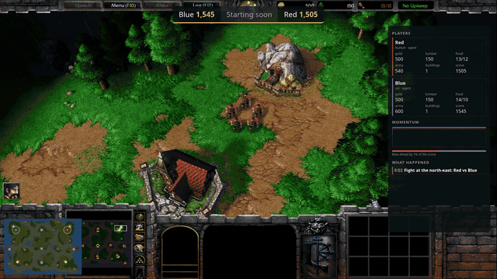
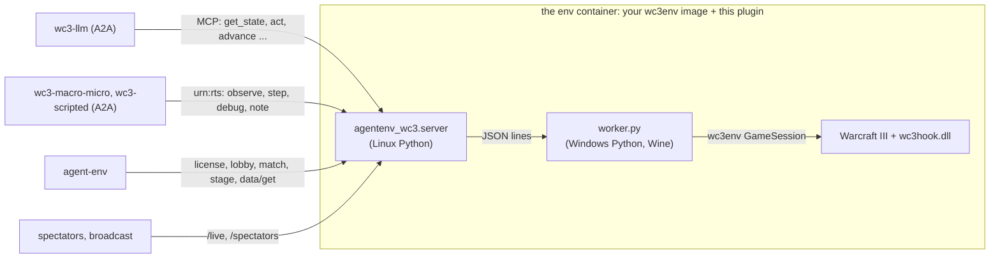

# Warcraft III for AgentEnv

[](LICENSE)
[](https://www.agentenvframework.com)



*The `broadcast-smoke` task on the real game, at about 3× speed: Red's four footmen fight Blue's three grunts at the
river, then Blue's survivors raid Red's peasants. Two scripted players, no model cost. Cropped from the match's
broadcast, recorded with [agentenv-game-env](https://github.com/earakely-scale/agentenv-game-env)'s
`start_broadcast`; the whole broadcast, with its overlay, is at the top of that README.*

AI agents play Warcraft III: The Frozen Throne through [wc3env](https://github.com/pwang724/wc3env).
- **Who they play:** the game's own AI, each other (model against model), as a team, in a free-for-all, in short
  drills, or in wc3agent's mirror duels (two identical armies, against Warcraft's own way of fighting).
- **Who can play:**
  - any chat model, through MCP tools (`wc3-llm`);
  - wc3env's own two-model agent, `wc3agent`, in which a macro model plans and a fast micro model controls each unit
    (`wc3-macro-micro`);
  - a scripted opponent (`wc3-scripted`).
- **How you set it up:** one task JSON says who plays, on which map, with which races and teams, how the game starts,
  what is staged first and how it is graded, all without code.
- **How it's graded:** on the outcome: a win 1, a draw 0.5, a loss 0, where a game nobody has won by its time limit is
  a draw. A sweep plays each model against the game's AI at its three levels and reports the highest level it beats;
  each drill tests one skill, and each duel a model's control of an army.

Every game is graded, saved as a native `.w3g` replay and recorded. You can watch it live in the game's own picture,
with the agents' plans beside it, and broadcast it to Twitch or X, or only record the broadcast.

Three v1 task sets, and every run of them by five models, are on the Hugging Face Hub as the dataset
[earakely-scale/wc3env-AgentEnv](https://huggingface.co/datasets/earakely-scale/wc3env-AgentEnv). The
[Space](https://huggingface.co/spaces/earakely-scale/wc3env-AgentEnv) replays every run in the browser; see
[On the Hugging Face Hub](#on-the-hugging-face-hub).

This repository is an environment plugin for the [AgentEnv Framework](https://www.agentenvframework.com), built on
[agentenv-game-env](https://github.com/earakely-scale/agentenv-game-env), which gives a game env its lobby, match,
license and broadcast. Its RTS-generic half, `agentenv_rts`, is meant for the next real-time strategy game too.

> **Unofficial, offline, and bring your own game.** This project is not affiliated with or endorsed by Blizzard
> Entertainment; Warcraft is their trademark. It contains no game files: wc3env runs your own licensed Warcraft III
> Legacy (1.29.2) installation, offline only, never on Battle.net. The env image you build holds your game files:
> keep it private. Whether this use fits your license agreement is your responsibility.

**Status:** played on the real game (Warcraft III Legacy 1.29.2 under Wine, x86-64 Linux, Docker).
- **Tasks that ran there:** `smoke`; a chat model through the MCP tools against the AI (`vs-ai-quick`); wc3agent
  against the AI, stepped and in realtime, broadcast; two agents in a lockstep duel; drills; and a sweep of four
  models × two maps × three seeds, run twice ([first-eval](docs/evals/first-eval.md), about $4 each). The
  [Tasks](#tasks) table has times, costs and grades.
- **Multiplayer rules, checked there with no model:** a team wins together; a free-for-all plays to the last player;
  a fixed seed replays a game step for step; no game starts until every player has made its first move.
- **Chaos-tested there**, by breaking things on purpose mid-game:
  - **An agent's container killed:** the others play on without it.
  - **The game process killed:** every player is told the game failed.
  - **The broadcast's container killed:** the game is still played, graded and recorded.
  - **Activation-file secrets corrupted or missing:** refused, with a clear error.
  - **Path traversal on match files, bogus player slots, and invalid lobby and match calls:** refused.
  - **Two tasks at once:** both pass.

Everything above the game also runs on wc3env's **fake game**, on macOS (Apple Silicon) and Linux, without
Warcraft III.

## Before you start

- **Python 3.11+ and [uv](https://docs.astral.sh/uv/).**
- **Docker**, and the local image registry agent-env stores images in:
  `docker run -d -p 5000:5000 --restart unless-stopped --name registry registry:2`.
- **A model endpoint** for the agents (`smoke` and `broadcast-smoke` need none): any OpenAI-compatible endpoint that
  serves model names like `anthropic/claude-haiku-4-5`, such as a [LiteLLM](https://docs.litellm.ai/) proxy. Give it
  to agent-env either way:

  ```bash
  export LITELLM_BASE_URL=https://your-endpoint.example.com LITELLM_API_KEY=...   # or, in .agentenv/config.toml:
  # [model]
  # base_url = "https://your-endpoint.example.com"
  # api_key = "env:LITELLM_API_KEY"       # a reference: secrets never go in the file
  ```

```bash
git clone https://github.com/earakely-scale/agentenv-wc3-plugin && cd agentenv-wc3-plugin
uv tool install agentenv-framework --with-editable .
agent-env config show                       # which config and model endpoint agent-env uses
```

## Try it without Warcraft III (Mac or Linux, 10 minutes)

wc3env's fake game is a stand-in world (a town hall, five peasants and a distant enemy hall; units move and stop,
nothing else), so every task runs end to end without the game:

```bash
agent-env wc3 setup --fake --agent          # the env on the fake game, and the agents (wc3-llm, wc3-macro-micro, wc3-scripted)
agent-env run wc3 --task smoke               # no model: the game runs, is graded and recorded (~1 min, $0)
agent-env run wc3 --task macro-micro-quick   # wc3agent, Haiku for macro and micro: 5 game minutes (~8 min, ~$1.20)
agent-env wc3 watch --open                   # while a game runs: its live view
agent-env wc3 recordings --out match         # afterwards: the run's match files and broadcast, in ./match
```

Name a task or an eval: with neither, `agent-env run wc3` runs every eval in the bundle, which is every drill and
every mirror duel once.

## Play the real game (x86-64 Linux)

The game runs under Wine in Docker, on an **x86-64 Linux host** (a laptop, a server or a cloud VM). Apple Silicon and
other arm64 machines can't run it; drive a Linux host from them instead. The one step that still needs Windows is
Battle.net's download of the game; everything else runs on the Linux host.

**1. Get the game.** Buy Warcraft III: Reforged on Battle.net (it includes the classic game). In the Battle.net app on
a Windows machine (a cloud Windows VM works), open the Warcraft III page, choose **Warcraft III - Legacy TFT 1.29** in
the Game Version dropdown, and install it. That is the one build wc3env supports (`1.29.2.9232`, checked by its
executable's hash), and installing it also puts the activation files `roc.w3k` and `tft.w3k` in its folder. Copy the
installed folder (`C:\Program Files (x86)\Warcraft III`, about 1.2 GB) to the Linux host. Battle.net under Wine on
the Linux host itself installs and opens, but its login page doesn't draw without a GPU yet.

**2. Build the worker image (on the Linux host).**

```bash
agent-env wc3 build-worker "$HOME/Warcraft III"   # wc3-worker:local, about five minutes
```

`build-worker` takes wc3env at the commit this plugin pins
([`eb660aa`](https://github.com/pwang724/wc3env/tree/eb660aa558fb6e5c639a1ff404082f7dc0ee483e)) and applies
`patches/wc3env-realtime-hold.patch`, which lets a realtime game wait at its start until every player has made its
first move (the hook's `hold` and `release`). It downloads wc3env's hook, `wc3hook.dll`, as this repository's
[Hook workflow](.github/workflows/hook.yml) built it from that commit and patch with MSVC on GitHub's Windows runner
and released it, and checks it against the SHA-256 pinned in `agentenv_wc3/cli.py`. Then wc3env's `prepare.py` checks
the executable's hash and copies only the game files and stock maps the worker needs, never the activation files, and
Docker builds the image. To build the hook yourself instead, run `wc3hook\build.bat` in that wc3env checkout on
Windows with Visual Studio Build Tools 2022.

**3. Store the activation files.** `license import` writes them into the file of agent-env's local secret store,
which `.agentenv/config.toml` names (an absolute path; the import creates the file):

```toml
[stores.secret]
impl = "agent_env.store.secret_store:LocalSecretStore"
config = { file_path = "/home/you/.config/agentenv/secrets.yaml" }
```

```bash
agent-env wc3 license import "$HOME/Warcraft III"  # stores roc.w3k and tft.w3k as WC3_ROC_W3K and WC3_TFT_W3K
agent-env wc3 license show                   # whether they are there, never what they contain
```

How the activation files reach the game:
- **Never in an image, never from a folder at run time.** The env declares them as its license (two `file` parts of
  the license `warcraft3`). Each task's `add_license` step (from
  [agentenv-game-env](https://github.com/earakely-scale/agentenv-game-env#licenses-urngamelicensev1)) reads them from
  agent-env's secret store and gives them to the env before the game is created. A task can't name files on the
  machine that runs it, so it can't send them anywhere.
- **Any secret store works,** each file in base64 under those names. Store them yourself in a cloud store (AWS or
  GCP); the local store also reads environment variables: `export WC3_ROC_W3K=$(base64 < roc.w3k | tr -d '\n')`, and
  likewise `WC3_TFT_W3K`.
- **A game that lacks them doesn't start:** its lobby refuses to close with `not_licensed`, naming each missing file
  and how to store it. `add_license` reads no secret when the env lacks nothing: on the fake game, or with the files
  mounted in the env's container at `WC3_LICENSE_DIR` (`/run/wc3-license`), as wc3env's own image takes them.

**4. Play.**

```bash
agent-env wc3 check                          # the host, your worker image, your activation files
agent-env wc3 setup --agent                  # the env on top of wc3-worker:local, as "wc3", and the agents
agent-env run wc3 --task smoke               # ~1 min: the game starts, runs two minutes, is graded and recorded
agent-env run wc3 --task vs-ai-quick         # Haiku 4.5 plays through the MCP tools against the easy Orc AI
agent-env run wc3 --task macro-micro-realtime   # Sonnet 5.5 + Haiku 4.5 against the normal Orc AI, 10 min, ~$11
agent-env wc3 recordings --out match         # its videos, highlights, HTML replay and .w3g, in ./match
```

**Disk:** each `setup` stores the env image, about 2.6 GB with the game, as a new version in agent-env's object
store (`~/.local/state/agent-env/object_store/artifacts/docker_image/mcp-server-wc3/<version>`). Old versions stay
until you delete them; keep the one your env is registered at.

**Watch from your laptop:** the env listens on the host's loopback. `agent-env wc3 watch` on the host prints its
address; forward it with `ssh -L 8080:127.0.0.1:<port> <host>` and open `http://localhost:8080/live`.

## Watch a game

While a game plays, the env serves a spectator view at `/live`: `agent-env wc3 watch --open` prints and opens it.

- **The map:** the match's map from wc3env's prepared map data (terrain from its pathing grid, trees, gold mines,
  start locations, creep camps and shops), with every unit and building any player sees, in its owner's colour.
- **The game's own picture:** with `client_view` in the match's settings, the game draws itself in a 1280×720 window
  on the container's 1920×1080 display (`WC3_WINDOW`, `WC3_SCREEN`). The env captures it with ffmpeg at 24 fps, and
  the page shows it as the main view (`/live/client`, an MJPEG stream at 12 fps; `/live/client.jpg` is the newest
  frame), with the map beside it. Drawing makes stepping about three times slower, so most tasks leave it off.
- **The camera director** (`frames.Director`): the agent's fights first, then its key moments (a hero, a tier, an
  expansion, a building lost), then its army around its strongest hero, with a look at the base every 30 s. Each shot
  holds at least 4 s, and the camera eases between nearby spots.
- **What the agents are thinking:** players tell spectators their plans, names ("Claude Sonnet 5.5 + Haiku 4.5") and
  running costs through `urn:rts:note/v1`. The page shows the plans under "Thinking", and the game's own picture
  draws the latest one.
- **The feed** (`frames.Feed`): names instead of unit ids, one line when a fight starts and one when it ends instead of
  one per blow, and the moments that matter in bold: heroes, levels, tiers, expansions, heroes and buildings lost.
  Creeping is minor news.
- **The sidebar:** each player's card with its army's value, and, for an agent, its spend and decisions per minute; a
  momentum graph of score and army over the game, and who is ahead. A slot's `label` names its player.
- **Before the start:** until every player has made its first move, the page shows who the game is waiting for, and
  its badge reads WAITING.
- **The timeline:** scrub through every step played so far.
- **For a broadcast:** `/live?view` is the game alone and `/live?panel` the sidebar alone (see
  [Broadcast a match](#broadcast-a-match)).

### Render a finished game in the game's own picture

A game played without `client_view` (most tasks) can get its video afterwards, from its replay:

```bash
agent-env wc3 recordings <instance> --out match   # its .w3g (and .w3g.json), timeline and HTML replay
agent-env wc3 render match/<game>.w3g --task <the task's JSON> --timeline match/<game>-timeline.json \
    --out match/game.mp4 --speed 8
```

`render` runs the env's image with the picture on:
- **The replay plays the game again.** wc3env plays the `.w3g` back, so the players' orders and the AI come from the
  recording.
- **Staging is applied again.** The task's staging comes back step for step before the playback, because debug
  commands aren't in a replay. Its orders, such as a hero learning its skills, are left to the recording.
- **The camera and the plans are the live game's.** The director points the camera, and the agent's plans from the
  timeline show in the game at the times it wrote them.
- **The pace is fixed.** It keeps one frame per `1/fps` of video, so the video plays at `--speed` times the game's
  pace.

Beside the MP4, `<out>.json` has the frames' pace and the playback's final scores. A playback that ends on the
scores the game recorded played the same game. It needs the env's image and your activation files, as a real game
does. `--source` runs a plugin checkout's code in the image, to try a change without a new `setup`.

## Game styles: how much the env does for the player

The same game can be played through three interfaces. Each is its own env or agent, and a task picks one.

| Style | Env or agent | How the player plays | What it tests |
|---|---|---|---|
| **raw** | env `wc3` | One model, units by id: `get_state`, `list_units`, `resources`, `lookup`, then `act` (JSON orders by unit id and coordinates) and `advance` | A general model with general tools |
| **commander** | env `wc3-commander` | One model through wc3agent's interface, from wc3agent's own code (MIT): a turn page with named units (`peasant1`), what it can do now and what not yet ("NOT YET: 70 more gold"), and how its orders went; orders in wc3agent's language through `command` (`build peasant1 Farm near goldmine1`, `group army footman1 footman2 attack at 1200 -300: take camp 3`); code acting for its groups between seconds; and wc3agent's unit menus through `fight` and `choose` | A model as a commander, with good affordances |
| **wc3agent** | agent `wc3-macro-micro` on env `wc3` | wc3env's own agent: a macro model on wc3agent's observations, and a micro model (Haiku 4.5 here, Jev with a TypeSafe key) answering each unit's menu, through the env's session | Peter Wang's design, as built |

- **Setup:** `agent-env wc3 setup --style commander` builds the commander env's image and registers it as
  `wc3-commander`. It is the same Dockerfile with `STYLE` set, so the images share every layer but the last. An MCP
  server env carries no settings of its own, so the style is part of the image (`WC3_STYLE`, `styles.py`).
- **Tasks:** a task names its env (`"env_id": "wc3-commander"`). Its prompt describes that style's tools:
  `prompts.COMMANDER_HOW_TO_PLAY` in place of `HOW_TO_PLAY`.
- **Sweeps:** `style = "commander"` plays a sweep's tasks in the commander style. `agent = {id = "wc3-macro-micro",
  env = {WC3_MICRO_MODEL = "..."}}` plays them with another agent; for a drill or a duel, that agent gets the goal
  pinned, as wc3agent's scenarios pin theirs. `sweeps/*-commander.toml` and `sweeps/duels-macro-micro.toml` are the
  comparison runs.
- **What the commander env takes from wc3agent:**
  - the macro memory, which reads every observation;
  - the turn page (`describe`) and the guide (`system_prompt`: rules, the order language, race, item and map sheets);
  - the order parser;
  - the reflexes that need no model: creep escape, loot, regrouping stragglers, idle fighters joining the army,
    skill points, gold-worker caps;
  - the unit menus (`candidates`, `build_request`).
- **What it does differently:** there is no micro model. A group fights by Warcraft's attack-move and the reflexes,
  unless the model takes the fight over with `fight` (each unit's options, numbered) and `choose`. The guide and the
  page say so, where wc3agent's texts speak of micro.
- **What it shares with the raw env:** the game, its stepping clock (`advance` plays one-second ticks, as
  wc3agent's stepping play does), staging, grading and recording, so the styles' results compare directly.

## Tasks

| Task | Who plays | Game | Measured on the real game |
|---|---|---|---|
| `smoke` | nobody: `finish_match` plays the game out | 2 minutes | 11 s, $0 (40 s before the stepped clock ran at 2048x) |
| `broadcast-smoke` | two `wc3-scripted` agents (attack and raid), staged armies, a recorded broadcast in the game's own picture | 2 minutes, stepped in lockstep, graded per player (`dense`) | 4 min, $0; the same game every time it ran, a draw at the limit; a 1080p broadcast of about 2 minutes |
| `vs-ai-quick` | `wc3-llm`: Haiku 4.5 through the MCP tools, Human | 5 minutes against the easy Orc AI | 75 s (3 min before the 2048x clock), $0.10 (52 model turns, prompt-cached); a draw: survived to the limit, outscored by the AI 8.7k to 4.8k. In `first-eval`, 6 games: 6 draws, $0.11 a game |
| `vs-ai` | `wc3-llm`: Sonnet 5.5 through the MCP tools, Human | 20 minutes against the normal Orc AI | in 30-minute games against normal: Sonnet 5.5 lost at 22.8 min ($1.22), Opus 5.5 drew ($2.36). The [ladder](docs/evals/ladder.md), 36 games of three low-cost models against easy, normal and insane: no win, $0.10 to $0.34 a game |
| `macro-micro-quick` | wc3agent: Haiku 4.5 macro, Haiku 4.5 micro | 5 minutes against the easy AI, stepped | 13 min, $0.80 with the prompt cache (254 decisions; $2.40 before it); a draw; wc3agent's report and session kept |
| `macro-micro` | wc3agent: Sonnet 5.5 macro, Haiku 4.5 micro | 20 minutes against the normal AI, stepped | not yet measured |
| `macro-micro-realtime` | wc3agent: Sonnet 5.5 macro, Haiku 4.5 micro | 10 minutes against the normal AI, in realtime, with the game's picture | 11 min, ~$11 |
| `duel-quick` | two wc3agents, Haiku 4.5 for both models, Human against Orc | 5 minutes, stepped in lockstep, graded per player (`dense`) | 19 min, $4.70 |
| `mirror-*` (4 races) | `wc3-llm` with Haiku 4.5 against `wc3-scripted` (Warcraft's way of fighting); `-baseline`: scripted on both sides | wc3agent's mirror duels: two identical 60-food armies of one race, decided once one is down to 40% of the other's strength, a draw at 150 s | [duels](docs/evals/duels.md): Haiku 4.5 won 2 and drew 1 of 9, $0.31 a duel; DeepSeek 3 of 9, GPT-5.4 mini 0 of 8. The baselines, Warcraft against Warcraft: player 0 59% over 48 duels, about 80 s of game time, $0 |
| `drill-*` (25) | `wc3-llm` with Haiku 4.5, against the AI or the scripted `wc3-scripted` | wc3agent's 25 scenarios as drills, one skill each: 1.5 to 10 minutes, graded on the share of their checks met | [drills](docs/evals/drills.md), all 25 for three models: Haiku 4.5 passed 3 and met 62% of the checks, $0.11 a drill; DeepSeek V4.1 Flash 11 and 82%, $0.02; GPT-5.4 mini 2 and 49%. About 3 minutes of wall time a drill |

`agent-env run wc3 --task <task>` runs one, and `--model <model>` plays it on another model without editing it (for
wc3-macro-micro, the macro model). The costs are model spend at list prices. On the fake game, `macro-micro-quick`
costs about $1.20 (there is nothing to fight, so the micro model is never asked).

- **Map and side:** the bundled tasks are all on Echo Isles, seed 1, with the agent playing Human (Orc too in
  `duel-quick`). Any stock map, race, seed and mix of players is a few lines of JSON away:
  [Write your own task](#write-your-own-task).
- **Drills:** all but `drill-full-game-easy` stage their start (`urn:wc3:stage/v1`), and each is graded by its checks.
  Each tests one of seven skills: economy, map control, defence, combat, creeping, hero and items, and a full game.
  The bundle has an eval per skill (`agent-env run wc3 --eval drills-combat`), and `agent-env run wc3` with neither a
  task nor an eval plays every drill and mirror duel once. The bundle's [README](src/agentenv_wc3/bundles/wc3/README.md) lists the 25
  drills; [docs/task-design.md](docs/task-design.md) is the design.
- **What every task saves** (`save_match_files`): the `.w3g` replay, an MP4 of the map, a self-contained HTML replay
  and the timeline as JSON, to recut or analyse a game without playing it again. `macro-micro-realtime` keeps the
  game's own video, with chapters, and a highlight reel in place of the timeline; its HTML replay plays the video
  beside the map once `agent-env wc3 recordings` puts both in one folder.
- **Grading:** `rts_grade` grades each agent. The full games use the `outcome` rubric:
  - a win 1, a draw 0.5, a loss 0; a win needs every enemy defeated, and a game nobody has won by the time limit is
    a draw;
  - the game's score, army and kills are kept beside the grade, for the record, but don't count;
  - the grade is 0 if the agent gave no orders;
  - a match with no outcome (cancelled, failed, or its game engine down) is void: the grade step fails, so the run
    shows failed rather than a loss;
  - an agent that fails mid-game has its game played out, and keeps its outcome.

  `duel-quick` and `broadcast-smoke` add the score, army, kills, buildings, tier, expansions and hero level
  (`dense`); drills use their own checks; `smoke` checks that the game ran to its limit and was played out.

## Write your own task

A task is a JSON list of steps, run as a DAG (a step without `depends_on` waits for every step before it). A WC3 task
is built from a few steps; the ones from agentenv-game-env are documented in full in
[its README](https://github.com/earakely-scale/agentenv-game-env#the-task-steps).

| Step | From | What it does |
|---|---|---|
| `deploy_env` | agent-env | Starts the env registered as `wc3` |
| `deploy_agent` | agent-env | Starts an agent: `wc3-llm`, `wc3-macro-micro`, `wc3-scripted` or any A2A agent that takes an MCP server. An agent that plays deploys with `"env_ids": []`: its player slot gives it its address |
| `add_license` | agentenv-game-env | Gives the env your activation files from agent-env's secret store (`files` names each file's secret); the game needs them when it is created |
| `open_lobby` | agentenv-game-env | Opens the match's lobby with its settings (map, seed, time limit, mode) |
| `add_player_slot` | agentenv-game-env | One per player: an agent, which then plays at `<env>/players/<player_id>/mcp`, or the game's AI, with its race, team, AI level and label |
| `close_lobby` | agentenv-game-env | Closes the lobby, which creates the game and its match |
| `apply_server_config` with `urn:wc3:stage/v1` | agent-env | Optional: stages the board before play (units, levels, items, resources, a paused AI) |
| `start_broadcast` | agentenv-game-env | Optional, after `close_lobby`: starts the broadcast and returns once it is live |
| `prompt_agent` | agent-env | One per agent: the prompt, and the model it plays on. It lasts the whole game |
| `finish_match` | agentenv-game-env | After every play step: plays the match out to its end, with no more orders from its agents |
| `save_broadcast` | agentenv-game-env | With `start_broadcast`, after `finish_match`: keeps the broadcast's video |
| `rts_grade` | this plugin | Grades each agent with a rubric, weights, targets and checks |
| `save_match_files` | agentenv-game-env | Keeps the match's files: the `.w3g`, the map's MP4, the HTML replay, the timeline JSON, and on request the game's video and highlights |

A game runs as this DAG:

```
deploy ─┬─► open_lobby ─┬─► add_player_slot (the AI) ──────────────────┐
        │               └─► add_player_slot (an agent) ◄─ deploy_agent ┤
        └─► add_license ───────────────────────────────────────────────┴─► close_lobby ─► stage ─► play (per agent)
                                                         ─► finish_match ─► rts_grade ─► save_match_files
   optional: close_lobby (or stage) ─► start_broadcast ─► play;  finish_match ─► save_broadcast
```

**Who plays** is the env's lobby (`urn:game:lobby/v1`): each player slot holds an agent or the game's AI, and its
`player_id` is the game's player number. Closing the lobby creates the game and its match (`urn:game:match/v1`).

**When the match starts:** `close_lobby` creates the game with its clock stopped. An agent's first move makes it
ready, and the match starts once every agent is ready, carrying out all their opening orders. Until then `get_state`
says so, the match's `get` shows each player `not_ready` or `ready`, and the live page shows "Waiting for …". After
`lockstep.stall_seconds` the match starts without an agent that has not moved, and its `status_detail` says so. A
realtime game waits like this only with the hook patch from step 2 of
[Play the real game](#play-the-real-game-x86-64-linux).

**When it ends:** by the game's rules, at its time limit, or played out by `finish_match` once its agents have
stopped. The match's `get` then says `finished`, how it ended, and each player's outcome (`won`, `lost`, `drawn` or
`undecided`) and scores (`score`, `units_killed`, `army`). An agent that stops before the end leaves its side to the
game, so every match is graded at its end.

### Model against model, with different kinds of agent

Claude Sonnet plays through the tools, against wc3agent on Haiku, in one recorded broadcast. This is an example; the
bundled agent-against-agent task is `duel-quick`:

```json
[
  {"id": "deploy", "type": "deploy_env", "env_id": "wc3"},
  {"id": "agent-a", "type": "deploy_agent", "agent_name": "sonnet", "a2a_agent_id": "wc3-llm", "env_ids": [],
   "depends_on": ["deploy"]},
  {"id": "agent-b", "type": "deploy_agent", "agent_name": "bot", "a2a_agent_id": "wc3-macro-micro", "env_ids": [],
   "env_vars": {"WC3_MICRO_MODEL": "anthropic/claude-haiku-4-5"}, "depends_on": ["deploy"]},
  {"id": "license", "type": "add_license", "env_id": "wc3", "depends_on": ["deploy"],
   "files": {"roc.w3k": "WC3_ROC_W3K", "tft.w3k": "WC3_TFT_W3K"}},
  {"id": "match", "type": "open_lobby", "env_id": "wc3", "depends_on": ["deploy"],
   "game_settings": {"map": "(2)EchoIsles.w3x", "seed": 7, "time_limit_seconds": 900}},
  {"id": "slot-a", "type": "add_player_slot", "env_id": "wc3", "player_id": "0", "player_kind": "agent",
   "player_name": "sonnet", "game_settings": {"faction": "human", "label": "Claude Sonnet 5.5"},
   "depends_on": ["match", "agent-a"]},
  {"id": "slot-b", "type": "add_player_slot", "env_id": "wc3", "player_id": "1", "player_kind": "agent",
   "player_name": "bot", "game_settings": {"faction": "orc"}, "depends_on": ["match", "agent-b"]},
  {"id": "start", "type": "close_lobby", "env_id": "wc3", "depends_on": ["slot-a", "slot-b", "license"]},
  {"id": "broadcast", "type": "start_broadcast", "env_id": "wc3", "title": "Sonnet vs wc3agent", "depends_on": ["start"]},
  {"id": "play-a", "type": "prompt_agent", "agent_name": "sonnet", "model": "anthropic/claude-sonnet-5-5",
   "prompt_id": "duel-a", "prompt": "Win this game of Warcraft III.", "depends_on": ["start", "broadcast"]},
  {"id": "play-b", "type": "prompt_agent", "agent_name": "bot", "model": "anthropic/claude-haiku-4-5",
   "prompt_id": "duel-b", "prompt": "Play the game the env has started to its end.",
   "depends_on": ["start", "broadcast"]},
  {"id": "finish", "type": "finish_match", "env_id": "wc3", "depends_on": ["play-a", "play-b"]},
  {"id": "save-broadcast", "type": "save_broadcast", "env_id": "wc3", "depends_on": ["finish"]},
  {"id": "grade", "type": "rts_grade", "env_id": "wc3", "rubric": "dense", "depends_on": ["finish"]},
  {"id": "files", "type": "save_match_files", "env_id": "wc3", "depends_on": ["grade"]}
]
```

### Teams, allies and free-for-all

Only the player slots change (and `map`: one with as many start locations as players). Player slots on one team are
allies (passive to each other, sharing vision) and win together. A player slot without a `team` is its own team, so
slots with no teams make a free-for-all. The lobby's `player_teams` lists the teams. Each line below is one
`add_player_slot` step's player and `game_settings`:

```jsonc
// two agents against two AIs, on (4)TurtleRock.w3x
"0" agent p1   {"faction": "human", "team": 1}
"1" agent p2   {"faction": "night_elf", "team": 1}
"2" ai         {"faction": "orc", "team": 2, "ai_level": "normal"}
"3" ai         {"faction": "undead", "team": 2, "ai_level": "normal"}
// an agent with an AI ally, against an AI (a 4-player map)
"0" agent p1   {"faction": "orc", "team": 1}
"1" ai         {"faction": "human", "team": 1, "ai_level": "easy"}
"2" ai         {"faction": "undead", "team": 2, "ai_level": "easy"}
// three agents, free for all: the game plays on until one is left
"0" agent a    {"faction": "human"}
"1" agent b    {"faction": "orc"}
"2" agent c    {"faction": "undead"}
```

### A drill: stage the board, grade on checks

A stage step puts units at named places, relative to the first agent's start, and names them for the grade:

```json
{"id": "stage", "type": "apply_server_config", "env_id": "wc3", "depends_on": ["start"],
 "directives": [{"service": "wc3", "uri": "urn:wc3:stage/v1", "args": {"ops": [
   {"op": "spawn", "player": "wc3", "type": "Hamg", "at": "home", "dx": -1300, "as": "hero"},
   {"op": "level", "unit": "hero", "level": 3},
   {"op": "give", "unit": "hero", "type": "phea"},
   {"op": "spawn", "player": "wc3", "type": "hfoo", "n": 5, "at": "home", "dx": -1150, "as": "army"},
   {"op": "spawn", "player": "opponent", "type": "ogru", "n": 4, "at": "home", "dx": -2500, "as": "enemy"},
   {"op": "ai", "player": "opponent", "paused": true}]}}]},
{"id": "grade", "type": "rts_grade", "env_id": "wc3", "player_names": ["wc3"], "rubric": "checks", "checks": [
   {"metric": "enemy_army_destroyed_percent", "op": ">=", "value": 100},
   {"metric": "army_kept_percent", "op": ">=", "value": 40},
   {"metric": "hero_alive", "op": "==", "value": true}], "depends_on": ["play"]}
```

Grades mix freely. For example, a full game that weighs the outcome three times as much as each other criterion,
ignores expansions, and rewards an early Keep twice as much as the outcome:

```json
{"id": "grade", "type": "rts_grade", "env_id": "wc3", "rubric": "dense",
 "weights": {"outcome": 3, "expansions": 0}, "targets": {"hero_level": 3},
 "checks": [{"metric": "first_time:hkee", "op": "<=", "value": 300, "weight": 6}], "depends_on": ["play"]}
```

The [Reference](#reference) has every setting, op and grading option.

## Broadcast a match

A broadcast is the game's spectator view, `/live?view` (the game's own picture with `client_view`, the map as its
minimap; else the map), under [agentenv-game-env](https://github.com/earakely-scale/agentenv-game-env#broadcasting-a-match)'s
overlay: a score bug with each player's score and the game clock, sponsor banners, a title card, an end card, and any
page as a widget. The env's spectator card, at `/spectators`, gives the overlay its view; the overlay reads only the
lobby and the match, so it needs nothing else from the game.

**In the task: `start_broadcast` and `save_broadcast`.** `start_broadcast` starts the broadcast once the lobby has
closed, and returns when the stream is live. The agents' `prompt_agent` steps depend on it, so the match, which starts
at their first moves, is on air from the start. `save_broadcast`, after `finish_match`, waits for the broadcast to end
and keeps its video as a file artifact of the run:

```json
{"id": "broadcast", "type": "start_broadcast", "env_id": "wc3", "to": ["twitch"], "title": "Sonnet vs the Orc AI",
 "overlay": [{"widget": "score_bug"}, {"widget": "page", "url": "env:/live?panel", "box": [1500, 100, 396, 800]},
             {"widget": "end_card"}],
 "depends_on": ["start"]},
{"id": "play", "type": "prompt_agent", "agent_name": "sonnet", "depends_on": ["start", "broadcast"], "...": "..."},
{"id": "finish", "type": "finish_match", "env_id": "wc3", "depends_on": ["play"]},
{"id": "save-broadcast", "type": "save_broadcast", "env_id": "wc3", "broadcast": "broadcast",
 "depends_on": ["finish"]}
```

- **WC3's panel for the overlay:** `env:/live?panel` is the live view's sidebar alone, on a transparent page: what
  each agent says it is planning, each player's card, the momentum graph and the big moments.
- **Where it goes:** `to` takes `twitch`, `x` or both, with the stream keys in agent-env's secret store
  (`TWITCH_STREAM_KEY`; `X_STREAM_SERVER` and `X_STREAM_KEY`). Without `to`, it only records. agentenv-game-env's
  README has every field: the title, display names, theme, banners and widgets.
- **The streamer** is a container on the machine that runs agent-env; its image builds the first time, which takes a
  few minutes.
- **When it ends:** `linger_seconds` after the match is over. `save_broadcast` ends it sooner if the match's clock
  stands still for `stall_seconds` (a run whose play failed), or if the run is cancelled. A run that stops before
  `save_broadcast` leaves no stream up: the streamer ends itself a minute after the env is gone.
- **If it fails,** the run goes on, and the error is noted in the run's `metadata["broadcast_errors"]`, unless the step
  sets `fail_task_on_error`. If the streamer dies mid-game, the video it had recorded so far is kept. The videos are
  listed in the run's `metadata["broadcasts"]`.
- **An example:** `broadcast-smoke` records two scripted players in the game's own picture, at no model cost.

## Sweeps: one task across models, maps, seeds and AI levels

A sweep crosses template tasks over the axes you name, plays every combination under a spend budget and reports the
outcomes. The spec is a TOML file. The ladder, [sweeps/ladder.toml](sweeps/ladder.toml), plays each model against the
game's AI at all three levels:

```toml
name = "ladder"
template = "vs-ai"                # a bundled task, a glob of them (drill-*), or a path to a task file
models = ["fireworks_ai/deepseek-v4p1-flash", "anthropic/claude-haiku-4-5", "openai/gpt-5.4-mini"]
maps = ["(2)EchoIsles.w3x", "(2)TerenasStand.w3x"]
opponents = [{computer = "easy", race = "orc"}, {computer = "normal", race = "orc"}, {computer = "insane", race = "orc"}]
seeds = [1, 2]
time_limit_seconds = 1800         # games won or lost end sooner
max_cost_usd = 2.0                # a game's cap: wc3-llm stops playing there
```

```bash
agent-env wc3 sweep generate sweeps/ladder.toml runs/ladder   # 36 tasks, an eval and sweep.json
agent-env wc3 sweep run runs/ladder --budget 20 --parallel 2
agent-env wc3 sweep report runs/ladder --out docs/evals/ladder.md
```

- **Generate** writes a bundle folder:
  - one task per combination (`ladder-gpt-5.4-mini-terenasstand-vs-normal-orc-s2`), with that map, seed, race and
    opponent on the match, and on the player's steps that model, a prompt for that race and map, and the cap
    (`WC3_MAX_COST_USD`);
  - an eval of all of them, which `agent-env run runs/ladder` plays like any bundle's;
  - `sweep.json`, each task's axes.
- **Axes:** `models`, `maps`, `races` (`human`, `orc`, `undead`, `night_elf`), `opponents` (`{computer = "easy",
  race = "orc"}`; `easy`, `normal` or `insane`, the game's only levels) and `seeds`. An axis left out keeps each
  template's own. Also `time_limit_seconds`, `player_step` (the `prompt_agent` step that gets the model, `play` by
  default) and `prompt`, a template with `{race}`, `{map}`, `{players}`, `{difficulty}`, `{opponent}`, `{minutes}`,
  `{worker}` and `{supply}`. Drills keep their own prompts: a drill sweep sets `prompt = ""`
  ([sweeps/drills.toml](sweeps/drills.toml) plays all 25 with three models).
- **Run** plays the games one `agent-env run` each, logged under `logs/`. It starts a game only while the spend so
  far plus `max_cost_usd` for every game in play fits `--budget`, so the budget holds even if every game hits its cap
  (a game can pass its cap by its last model call). Each finished game is a line of `results.jsonl`: grade, outcome
  (or why it was void), score against the opponent's, orders, model turns, spend, and the agent's error if it failed
  mid-game, read from the run's stored summary. Run it again to play the rest.
- **Report**, for full games, ranks the models on points (a win 1, a draw 0.5, a loss 0), then on their share of the
  game's score. For each it gives won / drawn / lost, void games, the score against the opponent's, the cost and turns
  a game and how many games hit the cap; then won-drawn-lost at each AI level and the highest level beaten (at least
  three in four games won); then each map's points seed by seed. For drills it gives each model's drills passed
  (every check met) and share of checks met, by skill and by drill.

**The first sweeps** ran before outcome grading, and their write-ups quote the grades of then, which blended the
outcome with the game's score. On outcomes:
- **[first-eval](docs/evals/first-eval.md):** four low-cost models against the easy AI, 24 five-minute games, run
  twice for about $4 each. Every game was a draw at the limit. On score share the order was the same in both runs:
  Gemini 3.8 Flash (it hit its $0.50 cap in every game, and is the only one that attacks), DeepSeek V4.1 Flash (for
  $0.01 a game), Haiku 4.5, GPT-5.4 mini. The first run's post-mortem found a harness bug: a type name shared by
  several types, such as "Barracks" or a hero's name, went to the game unresolved. Since the fix (887d7f8), refused
  orders are under one a game and armies come 50 to 100 s sooner.
- **[vs-normal](docs/evals/vs-normal.md):** three of those models for 12 minutes against the normal Orc AI, 12 games
  for $1.45. DeepSeek V4.1 Flash 0 / 4 / 0 (0.50 points), Haiku 4.5 0 / 3 / 1 (0.38), GPT-5.4 mini 0 / 2 / 2 (0.25).
  No model has won a game yet, which is why the ladder plays 30-minute games.

## On the Hugging Face Hub

The dataset [earakely-scale/wc3env-AgentEnv](https://huggingface.co/datasets/earakely-scale/wc3env-AgentEnv) holds three
v1 task sets as bundles, and every run of them from 2026-10-09. The Space
[earakely-scale/wc3env-AgentEnv](https://huggingface.co/spaces/earakely-scale/wc3env-AgentEnv) replays every run in
the browser. Both are in the collection
[wc3env on AgentEnv](https://huggingface.co/collections/earakely-scale/wc3env-on-agentenv-6ac924a8810f02942599a5a4).

| Bundle | Tasks | Runs | Tables |
|---|---|---:|---|
| `wc3-v1-drills` | the 25 drills, an eval per skill | 75 | `drills_tasks`, `drills_episodes` |
| `wc3-v1-ladder` | Human against the easy, normal and insane Orc AI × Echo Isles and Terenas Stand × seeds 1 and 2, 30-minute games | 38 | `ladder_tasks`, `ladder_episodes` |
| `wc3-v1-duels` | the mirror duels, four races × seeds 1 to 4 | 26 | `duels_tasks`, `duels_episodes`, `duels_references` |

- **WC3's tables:** each run's outcome, score, checks and cost.
- **agentenv-hf's** (`<bundle>_tasks`, `<bundle>_episodes`): each task's steps and each run's record and chat
  transcript. A run has the same `episode_id` in both kinds.
- **Each run's files,** under its `episode_id`:
  - its video in the game's own picture, rendered from its replay (`videos/`);
  - its HTML replay, which plays the video beside the env's map (`replays/`);
  - its timeline as JSON (`timelines/`);
  - the game's `.w3g` replay with its startup options (`w3g/`);
  - from env v34, `wc3-llm`'s untrimmed transcript (`transcripts/`).

  The 24 Warcraft-against-Warcraft duels have theirs too.
- **Not in it:** game files and activation files. The `.w3g` replays need your own game to watch.

Each release tags the dataset with the plugin's version. The plugin depends on
[agentenv-hf](https://github.com/earakely-scale/agentenv-hf-plugin), which adds `agent-env hf run` and
`agent-env hf publish`. After the setup in [Play the real game](#play-the-real-game-x86-64-linux), play a bundle's
task straight from the Hub:

```bash
agent-env hf run earakely-scale/wc3env-AgentEnv@v0.4.0 --task drill-opening --model anthropic/claude-haiku-4-5
agent-env hf run earakely-scale/wc3env-AgentEnv@v0.4.0 --bundle wc3-v1-ladder \
    --task ladder-echoisles-vs-easy-orc-s1 --model anthropic/claude-haiku-4-5
```

`hf run` plays `wc3-v1-drills` unless `--bundle` names another. A bundle's task leaves the model to `--model`, or to
`wc3-llm`'s default, Haiku 4.5. `hf run` checks that this plugin is installed and the env and agents are set up before
it plays.

**Building the dataset and the Space.** `scripts/hub_dataset.py` has a step for each part. Each sweep's runs are
filed under their v1 task by the task's axes, since a sweep's task names carry the model.

1. **`build`** runs on the host that ran the sweeps, since it reads their folders and the agent-env store they wrote
   to. Before anything is written, every file is checked for keys (agentenv-hf's check) and for this machine's paths
   and hosts.
2. **`videos`** renders every run's video (`agent-env wc3 render`, three at a time, keeping videos already made). It
   rebuilds each replay page around its video, and adds `video` and `video_in_sync` to WC3's rows. It runs on a host
   with the env's image and your activation files.
3. **`media`** cuts the card's clip and the Space's thumbnail from the featured duel's video, with ffmpeg and Pillow.
4. **`space`** writes the Space: the page in `hub/space/`, `runs.json`, and a still for each featured run. The Space
   loads replays and videos from the dataset at the tag `runs.json` pins, so it holds no game data of its own.
5. **`push`** sends a folder to the Hub, from a machine with a Hub login, as one commit, and tags it.

```bash
python scripts/hub_dataset.py build --runs ~/runs --out build/hub/dataset   # prints each table's rows
python scripts/hub_dataset.py videos build/hub/dataset
python scripts/hub_dataset.py media build/hub/dataset
python scripts/hub_dataset.py space build/hub/dataset --out build/hub/space
python scripts/hub_dataset.py push build/hub/dataset --tag v0.4.0 --message "v0.4.0: ..."
python scripts/hub_dataset.py push build/hub/space --type space --message "v0.4.0: ..."
```

To release:
1. Bump `version` in `pyproject.toml`, and every `v0.4.0` pin in this section and in `hub/dataset/README.md`.
2. Tag the plugin on GitHub first, because the card's needs pin that tag.
3. Push the dataset with its tag.
4. Push the Space, which loads replays from that tag.

## The agents

`agent-env wc3 setup --agent` builds all three and registers them under their ids.

### wc3-llm

`agents/wc3-llm` lets any chat model play through the env's MCP tools (`get_state`, `act`, `advance`, …): any model
agent-env's model endpoint serves that calls tools. The `vs-ai` tasks use it, and it plays any player slot.
- **The loop:** a plain tool loop. The model calls tools until it answers without one; if the game isn't over yet, it
  is told to keep playing.
- **Long games fit:**
  - once the tool results pass about 120k characters, all but the last six are trimmed at once;
  - the system prompt and the newest message are marked for prompt caching (Anthropic models through LiteLLM), so
    each turn pays for its history once.
- **Spectators** see its model as its name, what it writes between tool calls as its plan, and its running cost.
- **The result** reports the turns, tool calls, tokens and cost. Its trajectory is the conversation.
- **The transcript:** every message untrimmed (what each tool returned, every order), left with the match as
  `wc3-llm-transcript.json` (`agent_files`), so a reader can see what the model read and did.

| Setting | Where | Default |
|---|---|---|
| Model | the `prompt_agent` step's `model` (or `agent-env run --model`) | `anthropic/claude-haiku-4-5` |
| Stop playing once the game has cost this much (USD); `finish_match` then plays it out | `WC3_MAX_COST_USD` in the `deploy_agent` step's `env_vars` (a sweep sets it to `max_cost_usd`) | no cap |

### wc3-macro-micro

`agents/wc3-player` wraps wc3env's own agent, `wc3agent`, in A2A, unchanged. It runs the same prompts, order parsing,
fixed policies and cadence:
- **Macro (System 2)** reads a text snapshot and writes orders (`train`, `build`, `group … attack at X Y`, …) at least
  5 game seconds apart.
- **Micro (System 1)** answers one multiple-choice question per army unit, at most once a second per group.

It plays the game the task's `close_lobby` created, at its player slot's address, through the env's `urn:rts` session
(raw observations in, raw wc3env actions out). It plays stepped (the game waits for the models) or in realtime (the
game runs on, and slow answers just mean fewer decisions), as the match's `mode` says. The `prompt_agent` step's
prompt is wc3agent's goal, which it keeps first in every macro request.

| Setting | Where | Default |
|---|---|---|
| Macro model | the `prompt_agent` step's `model` | `anthropic/claude-sonnet-5-5` |
| Micro model | `WC3_MICRO_MODEL` in the `deploy_agent` step's `env_vars` | `anthropic/claude-haiku-4-5` |
| Stop playing once the game has cost this much (USD); `finish_match` then plays it out | `WC3_MAX_COST_USD` (a sweep sets it to `max_cost_usd`) | no cap |
| Macro reasoning effort | `WC3_MACRO_REASONING` | `low` |
| Game seconds between macro turns | `WC3_TURN_SECONDS` (5 or more) | `5` |
| Stop after this much game time | `WC3_MAX_GAME_SECONDS` | the match's time limit |
| The prompt is a goal (a drill's), pinned in every macro request | `WC3_GOAL=prompt` | off: a whole game |

**The micro model:**
- **A chat model** (the default) is asked through the same OpenAI-compatible endpoint. The answers come back in
  Jev's shape, so wc3agent's checks, records and reports work as they do on Jev. A missing or invalid answer falls
  back to "keep doing what you're doing".
- **Measured on Haiku 4.5**, on a real wc3agent fight request (an archmage and two footmen against grunts): valid
  answers for every unit in 1.1 s, for about 2k input tokens, or a quarter of a cent.
- **`jev`** (or a `jev-…` model name) asks TypeSafe's Jev instead, with `TYPESAFE_API_KEY` in the agent's
  environment. **`off`** plays without micro.

**Cost:** every call is priced as LiteLLM reports it (its response-cost header), so a model wc3agent's rates table
doesn't name is priced too. A Claude macro model's system prompt and newest message are marked for prompt caching, as
wc3agent marks them on Anthropic's own API.

**The result** reports the macro turns, the micro calls, and the tokens and cost per model; a game stopped at its
cap reads `stopped at its cost cap`. Its trajectory is wc3agent's call log, with each decision and its cost. Its
report, wc3agent's own `report.html` (each macro turn's observation, reply, orders and their outcomes, with the micro
decisions under it), and its session folder (calls, actions, outcomes, transcript, summary), zipped, go to the env,
which keeps them with the match's files (`agent_files`).

### wc3-scripted

`agents/wc3-scripted` plays a player slot as wc3agent's scripted opponents do, with no model, through the env's
`urn:rts` session. It reads the other side's units from its observations, so it plays an `omniscient` player slot.
It doesn't read its prompt.

| Setting (`deploy_agent` `env_vars`) | What | Default |
|---|---|---|
| `SCRIPT` | `attack`: attack-move its army (at most 64 units) at the other side's army; `raid`: at its workers, else its first building; `idle`: no orders | `attack` |
| `SCRIPT_AFTER_SECONDS` | game seconds after its first observation before its first order | `0` |
| `SCRIPT_EVERY_SECONDS` | game seconds between its order rounds | `5` |

## Reference

### The match's settings: `open_lobby`'s `game_settings`

Warcraft III's match settings. The env's card publishes them as a JSON Schema in the lobby's `open` request; a setting
the env doesn't take is refused as the lobby opens. A run can override any of them through agent-env's per-run step
overrides (`{"game_settings": {"seed": 7}}`).

| Setting | What | Default |
|---|---|---|
| `map` | A map in the game's Maps folder, or a path to one: e.g. `(2)EchoIsles.w3x`, `(2)TerenasStand.w3x` or `(4)TurtleRock.w3x`, all played on the real game | `(2)EchoIsles.w3x` |
| `seed` | The game's random seed: in stepping mode the same seed and the same orders replay a game exactly | a new seed each game |
| `randomize_starts` | Shuffle the start locations | `false` |
| `time_limit_seconds` | Game seconds until an undecided game ends, 60 to 14400 | `1200` |
| `mode` | `stepping` (time passes as the agents step) or `realtime` (the game's own clock) | `stepping` |
| `lockstep` | `{"stall_seconds": n}`: how long a silent agent holds up the start or a lockstep turn, once | `600` |
| `step_ms` | Game milliseconds one step of wc3env's engine plays, 25 to 60000 | `1000` |
| `client_view` | Draws the game: its picture live and in the recording; its clock then runs at the game's own speed | `false` |
| `allow_debug` | Lets an agent's `urn:rts:debug/v1` stage the game (keep it off for evaluations) | `false` |
| `finish` | `{metric, op, value, after_seconds}`: the match ends once the first agent's metric holds (without `op`, once it is truthy), `after_seconds` later, as wc3agent ends a scenario; every agent's result is then `finished`, a draw. The drills set it | none |
| `decide_ratio` | A staged fight ends once one side's army (the stage's handles `army` and `enemy`) is down to this share of the other's strength: that side lost, the other won. The mirror duels set 0.4 | none |

**The clock:** a stepped game without `client_view` runs its clock at 2048× with a 1 ms wait floor, as wc3env's own
pools do. A tick is the same tick at any speed; only the wall time between ticks shrinks, so `smoke` takes 11 s instead
of 38. Realtime and `client_view` keep the game's own speed. The env owns the clock: an agent's `speed` op (wc3agent
sends one) is accepted and ignored.

### Player slots: `add_player_slot`

`player_id` is the game's player number, from `"0"` to one less than the map's start locations. `player_kind` is
`agent`, with `player_name` a `deploy_agent` step's `agent_name`, or `ai`. `"register": false` keeps an agent's player
slot for a player that connects on its own (`smoke` keeps one that nobody plays). A slot's `game_settings` (published
in the lobby's `fill` request) are:
- `faction`: `human`, `orc`, `undead`, `night_elf` or `random` (default `random`);
- `team`: 1 to 12 (default: its own);
- `label`: its name for spectators and the broadcast;
- agents only: `ai_assist`, so the game's AI also plays the agent's side; `autocast`, so its units cast their spells
  on their own, as the game has a computer player's do (wc3env's `computer_agents`; the mirror duels set it for both
  sides); and `omniscient`, so its `urn:rts` session observes every player (for scripted opponents);
- the AI only: `ai_level`, `easy`, `normal` or `insane` (default `normal`).

A match takes no more players than its map's start locations, and at least one agent. Every AI player slot shares
one level, because the game has one AI level.

### Stage ops: `urn:wc3:stage/v1`

Harness time, not the agents': `apply_server_config` sends the ops in order, after `close_lobby` and before play.
- **The hook's ops:** `spawn`, `level`, `give`, `item`, `hp`, `mana`, `kill`, `remove`, `resources`, `ai`
  (`paused`), `research` (`type`, `level`), `invulnerable`, `alliance` and `destructable`.
- **The env's own:**
  - `formation`: `army` `[[type, n, row, level?], ...]` in rows `row` deep behind a front line `gap` (750) from the
    middle of the starts, toward the player's own (`swapped`: the other's; an odd seed's by default, so a sweep over
    seeds gives each player each ground), spread `spacing` (100) apart, each unit nudged up to `jitter` (40) by
    `seed` (the match's by default). Formations with one seed are mirror images: wc3agent's duel layout. Given a
    list of players (and one `as` handle each), it makes their armies unit by unit, alternating which of a mirror
    pair comes first.
  - `learn`: a handle's heroes spend every skill point, the same way for every player: wc3agent's standard build for
    the hero (`hero_builds.json`), else the deepest skill open now. It counts the skills already ordered, since the
    observation can trail them.
  - `autocast`: every autocast ability of a handle's units on.
  - **Staging two sides fairly:** an op's `unit` may be a list of handles, which it stages in the same steps. A side
    staged wholly after the other won about seven Human mirror duels in ten, so the mirror duels make both armies
    in one `formation` and give `learn`, `autocast` and `mana` both handles.
  - `clear`: remove every creep any player can see.
- **`player`:** an agent's name, `opponent` (the first player not on the first agent's team), or a player number; the
  first agent by default.
- **Places**, measured from the first agent's start: `home`, `enemy_home`, `middle` (between the two),
  `nearest_camp`, `camp:<n>`, `building:<name>` and `toward:<place>:<distance>`, each with optional `dx` and `dy`.
- **Handles** (`as`) name the units an op makes, for later ops (`unit`). `army` and `hero` (a player's own) and
  `enemy` (its opponents') also feed `army_kept_percent` and `enemy_army_destroyed_percent`.
- **`warmup_seconds`** (up to 600) lets the game run before the ops.

### Grading: `rts_grade`

- **`rubric`:** `outcome` (the default), `dense`, `checks` or `smoke`.
- **`weights`:** reweigh any criterion; 0 drops it, and weighing another rubric's criterion adds it. The criteria are
  `outcome` (a win 1, a draw 0.5, a loss 0; a game nobody has won by the time limit, or one its `finish` ended, is a
  draw, and a fight `decide_ratio` decided is a win and a loss); `outscore`,
  `army_ratio`, `kills_ratio`, `buildings_destroyed`, `tier`, `expansions` and `hero_level` (which `dense` adds);
  `ran_to_limit` and `played_out` (`smoke`). Under `outcome`, rows for the score, army and kills report them with no
  weight. A rubric with `outcome` raises on a match that has none (cancelled, failed, or its engine down), failing
  the step: such a match is void, not lost.
- **`targets`:** full credit for `army_ratio` (default 1), `buildings_destroyed` (5), `tier` (3), `expansions` (1) and
  `hero_level` (5).
- **`checks`:** each is `{metric, op, value, weight}` on wc3agent's metric names, with `op` one of `>=`, `<=`, `==`,
  `>` and `<`; a check without `op` only reports its metric. For example: `units_lost`, `army_kept_percent`,
  `camp_cleared_time`, `supply_blocked_seconds`, `idle_worker_seconds` and `hero_level`, or per type, `count:<type>`,
  `first_time:<type>` and `present_seconds:<type>`.
- **`gates`:** `game_ran` and `agent_played`, both by default. A failed gate zeroes the grade.
- **`player_names`:** which agents to grade; every agent by default.
- **`verifier_id`:** the grade's name, the step's id by default; with several agents graded, each is
  `<verifier_id>:<agent>`. Grades go in the run's `metadata["verifications"]`, and the summary they came from in
  `metadata["rts_summary"]`.

### Playing out and saving: `finish_match` and `save_match_files`

**`finish_match`**, once every play step has ended, plays a match still going to its end (the time limit at most),
with no more orders from its agents: they wait, and then find the game over. That time is the harness's
`finish_seconds` in the summary. The final match goes in the run's `metadata["game_match"]`, and `rts_grade` adds a
row of information (no weight) saying how it ended and each player slot's last move. `cancel_match` ends a match where
it stands instead.

**`save_match_files`**: `kinds` picks among WC3's match files; without it, the default ones. Each is kept as a file
artifact, listed in the run's `metadata["match_files"][<step id>]`.

| Kind | What | Default |
|---|---|---|
| `replay` | The game's native replay (`.w3g`), once the game has reached its end, and beside it the startup options wc3env wrote for playing it back (`.w3g.json`: the match setup, AI level and AI slots) | yes |
| `agent_files` | The files each player left with the match through `urn:rts:file/v1`: `wc3-macro-micro` leaves wc3agent's `report.html` and its session, zipped; `wc3-llm` its transcript | yes |
| `map_video` | An MP4 of the map, a frame per step | yes |
| `html_replay` | The spectator page with the whole game embedded, which plays in any browser | yes |
| `timeline` | The timeline as JSON: every frame's units, events and notes | yes |
| `client_video` | The game's own video (`client_view`), with a chapter at each major moment; asking ends the capture | no |
| `highlights` | A reel of at most two minutes cut from that video; asking ends the capture | no |

## How it works



**Who holds the clock:** wc3env does.
- **Stepping:** time passes only when the agents step, with `advance` for the tools and `urn:rts:step/v1` for a
  program. An agent may think as long as it likes between steps.
  - **Several agents** move in lockstep: the game moves once every one of them has stepped.
  - **An agent that stops stepping** (a crash, or an agent that replied early) holds the others up once, for
    `stall_seconds`, and the game then goes on without it.
- **Realtime:** the game runs on its own clock, and a step only sends orders and observes.

**Players:** each agent plays at its own player slot's address, `<env>/players/<player_id>/mcp`, which
`add_player_slot` registers with it. The slot's env card there lists its MCP tools and the `urn:rts` session. It sees
and orders only its own side; an `omniscient` slot's session observes every player.

**How orders are checked:**
- Orders given with `act` are checked against wc3env's own rules: the unit is yours, the target is in view, and the
  arguments are well formed. Each order is checked on its own: one that fails is left out with why, and the rest
  are queued.
- wc3env takes a unit inside a gold mine, building or transport for no unit of the player's, and the game takes no
  order there. A miner spends part of each trip inside, so such an order is queued and kept back by `advance` until
  the unit is out, for one advance.
- A type given by name resolves to the one the ordering unit makes. That matters because names are shared: a
  Peasant's "Barracks" is the Human one, and an Altar's "Archmage" is not a campaign version. A build, train or
  research the unit can't do is refused at `act`, naming the units that can ("Town Hall can't build Farm; your
  Peasant can").
- `advance` sends them and reports what the game refused, the sites it chose for buildings, and what happened.
- The game drops an order it can't carry out without telling wc3env, as it shows a player "Not enough gold." on
  screen. `advance` names a train, research or build that never started with what it lacked when it was sent: gold,
  lumber or food (spent down the batch in order), the buildings it requires, or the hero rules (one of each hero,
  a second needs the tier 2 hall and a third the tier 3 hall). It names one only when the order left no trace after
  the step, so an order the game took is never reported.
- The game's observation drops a dead hero. The env remembers every hero a player has had, and `get_state` lists a
  dead one with its revive order (`revive {"target_id": ...}` on an altar), as a player sees its portrait.
- A program's batch is checked the same way. Orders that no longer apply are reported as rejected, by their index.

| Tool | What it does |
|---|---|
| `get_state` | Who you play and against whom, game time and limit, gold, lumber, food, units by type, heroes (dead ones too, with their revive order), idle workers, every structure and its production, enemies in view, nearby gold mines, start locations, the last step's events |
| `list_units` | One line per unit (yours, enemies, neutrals, or yours inside mines and buildings): id, type, position, hp, order; `details` adds what each can train, build, research and cast |
| `resources` | Gold mines, the nearest trees and items on the ground |
| `lookup` | Any unit, building, upgrade, item or ability: cost, time, stats, requirements, what it trains or researches, cast orders |
| `act` | Queue raw wc3env orders: `move`, `attack`, `smart`, `harvest`, `build`, `train`, `research`, `learn`, `cast`, `use_item`, `drop_item`, `buy`, `revive`, `stop`, `select`. Types, abilities and cast orders may be named (`"Footman"`, `"Blizzard"`) |
| `advance` | Send the queue and play 1-60 game seconds |

| AgentEnv piece | Here |
|---|---|
| Environment | `src/agentenv_wc3/server.py`, an `AgentEnvGameEnv` (agentenv-game-env): its lobby, `urn:game:lobby/v1` (WC3's settings, races, teams and one AI level), and its match, `urn:game:match/v1` (the start gate, the play-out, each player's outcome and scores, the spectator view at `/spectators` and the match's files); six MCP tools; `data/get` (the result, and per player slot its result and wc3agent's metrics); the extensions `urn:game:license/v1` and `urn:wc3:stage/v1`; the session `urn:rts:observe/v1`, `urn:rts:step/v1`, `urn:rts:debug/v1` and `urn:rts:note/v1`; and `/live` |
| Task steps | `add_license`, `open_lobby`, `add_player_slot`, `close_lobby`, `finish_match`, `cancel_match`, `save_match_files`, `start_broadcast` and `save_broadcast`, from agentenv-game-env; `rts_grade`, in `agentenv_rts/grade.py` |
| Agents | `agents/wc3-llm`: `wc3-llm`; `agents/wc3-player`: `wc3-macro-micro`; `agents/wc3-scripted`: `wc3-scripted` |
| Tasks | `src/agentenv_wc3/bundles/wc3/` |
| CLI | `agent-env wc3 check`, `setup` (`--fake`, `--agent`), `license` (`import`, `show`), `serve`, `watch`, `recordings`, `drills import`, `sweep` (`generate`, `run`, `report`) |

[docs/protocol.md](docs/protocol.md) is the worker's protocol.

## Reusable for other RTS games: `agentenv_rts`

`src/agentenv_rts` never imports Warcraft III. A new RTS env reuses all of it:

| Module | What it gives a game |
|---|---|
| `session.py` | The `urn:rts:*` session contract: the observe, step, debug, note and file extensions an env serves (`file`: a player leaves a file, such as its agent's report, with the match). `RemoteSession`, a stdlib-only gym-style client, lets an existing RTS agent play an AgentEnv env unchanged |
| `lockstep.py` | `Lockstep`, one game clock for several players that moves when every one has stepped (each plays at its own address, through agentenv-game-env's routing) |
| `timeline.py` | The spectator schema: the map once (bounds, terrain grid, trees, points of interest, players) and a compact frame per step (units, resources, events) |
| `live.py`, `viewer/` | The live view at `/live` and `/live/data.json?since=T`, with the game alone (`?view`, a spectator view), the sidebar alone (`?panel`) and a self-contained HTML replay |
| `recording.py` | A match's recording by kind: the MP4 of the map from the timeline (Pillow and ffmpeg), the HTML replay, the timeline, the game's video and highlights, written to a folder for the env's match files |
| `display.py` | The game's own picture from an X display: one ffmpeg writes the match's video and the live JPEG stream |
| `highlights.py` | A match's major moments on its video's clock: chapters embedded in the video and a highlight reel (ffmpeg) |
| `grade.py` | `rts_grade`: grades each agent from the env's `data/get` summary with a rubric set in the task (`outcome`, `dense`, `checks` on wc3agent's metrics, `smoke`), its weights, targets and gates ([the design](docs/task-design.md#rts_grade-judgement)) |
| `choices.py` | Unit-level decisions as choice questions any chat model answers, in Jev's shape |

A game supplies an adapter from its observations to the timeline (here `agentenv_wc3/frames.py`), serves the session
extensions and `/live`, gives agentenv-game-env its spectator card and match files, and brings its agent's policy
(here `wc3agent`).

## Not done yet

- **Casters.** The plugin's AI casters went with its own streamer; they come back in agentenv-game-env's broadcast.
  [An earlier broadcast with them](docs/media/broadcast-clip.mp4) (45 s, with sound): Claude Sonnet 5.5 and Haiku 4.5
  reach tier 2 against the normal Orc AI in `macro-micro-realtime` while two AI casters call it.
- **The harness's endpoints are open to agents.** An agent whose own tools can make HTTP requests (a shell, say)
  could reach the env's base address. There it could stage the game, start a new one, or see the whole map through
  `data/get`, the root session and `/live`. The agents here don't: they reach only their player slot's tools or
  session. A separate harness port, or a per-match token, would close it.
- **Realtime and the MCP tools:** in realtime, `get_state` shows the game as of the agent's last `advance`.
- **A dead agent holds its play step to its timeout.** agent-env's `prompt_agent` keeps polling an agent whose
  container died until the step's `timeout_seconds`. The game itself goes on without it. Keep play timeouts in
  proportion to the game.
- **Container options.** wc3env runs its worker with `--shm-size 256m` and `--init`; agent-env's `server`
  provider sets neither, and the real game has run without them so far.
- **The real game from a Mac:** the env on a remote x86-64 Linux host (a Modal VM sandbox, or a remote Docker host).
- **Upstream seams in wc3agent:** an injectable session and micro transport, so the agent needs no patching.
- **Parity with wc3env and wc3agent:** what's still missing.
  - Replay playback beyond rendering: `agent-env wc3 render` plays a `.w3g` back to film it, but no task re-observes
    a recorded game through the tools.
  - wc3env's binary observations, its `StepPool` and vector rollouts (many games per host, for RL), and its Modal VM
    and GCP runners.
  - The mirror duels run on Echo Isles, with the creeps in sight cleared and odd seeds swapping the armies' ground,
    not on wc3agent's flat arena map: building it needs StormLib, which wc3env's map tools load from a Windows DLL.
  - A human player slot; wc3agent's commander feedback and its decision-panel replay.
- **Battle.net on the Linux host.** Its installer and launcher run under Wine in a container, but on a host with no
  GPU the login page's embedded browser doesn't draw (its renderer restarts in a loop, with Mesa's software Vulkan
  and DXVK too), so the game's download still needs Windows. The rest of the setup runs on Linux.

## Development

The tests need wc3env and wc3agent importable. Put a wc3env checkout's sources on the path; its wheel is
Windows-only.

```bash
uv venv && uv pip install -e ".[dev]"
PYTHONPATH=path/to/wc3env/src:path/to/wc3env/wc3agent/src .venv/bin/pytest
.venv/bin/ruff check .
```

**Chaos tests** (real or fake game, no model):

```bash
scripts/chaos/run.sh chaos-agent-crash agent        # kill red's agent mid-game
scripts/chaos/run.sh chaos-game-crash game          # kill the game inside the env
scripts/chaos/run.sh chaos-broadcast-crash broadcast   # kill the streamer
```

Each one runs a `broadcast-smoke` with short timeouts, breaks it 10 game seconds in, and reports how the run ended.

`scripts/ci.yml` is the CI workflow: lint and the tests, then the images and `smoke` on the fake game. Copy it to
`.github/workflows/` to turn it on. `scripts/standin.sh path/to/wc3env` builds `wc3-worker:standin`, wc3env's image
layout on its fake game, as `agent-env wc3 setup --fake` does.
