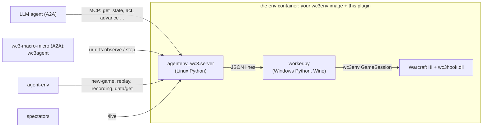

# Warcraft III for AgentEnv

AI agents play melee games of Warcraft III: The Frozen Throne against the game's own AI, through
[wc3env](https://github.com/pwang724/wc3env). An LLM can play through MCP tools, or wc3env's own two-model agent,
`wc3agent`, can play: a macro model plans the economy and the army, and a fast micro model controls each unit. The
micro model is Jev or any chat model, such as Claude Haiku. Spectators follow the game live, in the game's own
picture or on a map, and every game is graded, saved as a native `.w3g` replay and recorded as a video. This repository is an environment plugin for the
[AgentEnv Framework](https://www.agentenvframework.com). Its RTS-generic half, `agentenv_rts`, is meant for the next
real-time strategy game too.

> **Unofficial, offline, and bring your own game.** This project is not affiliated with or endorsed by Blizzard
> Entertainment; Warcraft is their trademark. It contains no game files: wc3env runs your own licensed Warcraft III
> Legacy (1.29.2) installation, offline only, never on Battle.net. The env image you build holds your game files:
> keep it private. Whether this use fits your license agreement is your responsibility.

**Status:**
- **Played on the real game** (Warcraft III Legacy 1.29.2 under Wine, x86-64 Linux, Docker): `smoke` passes, and
  `macro-micro-quick` (Haiku for macro and micro) built a base, trained a hero and fought creeps in 60 macro turns and
  302 micro calls, for $2.40. `macro-micro-realtime` plays with the game's own picture live and recorded.
- **Without the game:** everything above it also runs on wc3env's **fake game**, on macOS (Apple Silicon) and Linux.
  The fake game simulates a town hall, five peasants and a distant enemy hall; units move and stop, nothing else.

## Try it without Warcraft III (Mac or Linux)

```bash
uv tool install agentenv-framework --with-editable ./agentenv-wc3-plugin
cd agentenv-wc3-plugin
agent-env wc3 setup --fake --agent        # the env on wc3env's fake game, and the wc3-macro-micro agent, for this machine
agent-env run wc3 --task smoke             # no model: the game runs, is graded and recorded
agent-env run wc3 --task macro-micro-quick # wc3agent, Haiku for macro and micro: 5 game minutes, ~8 min, ~$1.20
agent-env wc3 watch --open                 # the live view of the running game
```

The agent's models go through agent-env's model endpoint (`[model]` `base_url` and `api_key` in
`.agentenv/config.toml`, e.g. a LiteLLM proxy).

## With the real game (x86-64 Linux)

**What it needs:**
- **An x86-64 Linux Docker host whose kernel runs Wine.** wc3env's `docker/platform_probe.py` checks it. Apple
  Silicon and other arm64 hosts can't run the game itself; see the fake game above, or run the env on a remote
  Linux host.
- **wc3env's worker image**, built from your own installation as its
  [docker/README.md](https://github.com/pwang724/wc3env/blob/main/docker/README.md) describes:
  1. Once, on a Windows machine, build the hook and prepare the data.
  2. Then, on any Linux builder:
     `docker build --platform linux/amd64 --target environment -t wc3-worker:local build/docker-context`.
- **Your activation files**, `roc.w3k` and `tft.w3k`, from the same installation, in `~/.wc3-license`. You can also
  name another directory with `license_dir` in `[plugins.agentenv-wc3]` of `.agentenv/config.toml`, or with
  `$WC3_LICENSE_DIR`. They never enter an image: the `wc3_match` step sends them to the env when a game starts.

```bash
agent-env wc3 check                        # the host, your wc3env image, your activation files
agent-env wc3 setup --agent                # the env on top of wc3-worker:local, as "wc3", and the agent
agent-env run wc3 --task smoke
agent-env run wc3 --task macro-micro-quick
```

## Tasks

| Task | Who plays | Game |
|---|---|---|
| `smoke` | nobody: the harness lets the game run | 2 minutes |
| `vs-ai-quick` | your default agent over MCP tools, Human | 5 minutes against the easy Orc AI |
| `vs-ai` | your default agent over MCP tools, Human | 20 minutes against the normal Orc AI |
| `macro-micro-quick` | wc3agent: Haiku 4.5 macro, Haiku 4.5 micro | 5 minutes against the easy AI, stepped |
| `macro-micro` | wc3agent: Sonnet 5.5 macro, Haiku 4.5 micro | 20 minutes against the normal AI, stepped |
| `macro-micro-realtime` | wc3agent: Sonnet 5.5 macro, Haiku 4.5 micro | 10 minutes against the normal AI, in realtime |

- **Map and side:** every game is on Echo Isles, with the agent playing Human.
- **What every task saves:** the game's native replay, and the spectator recording (an MP4 of the map and a
  self-contained HTML replay), as file artifacts. `macro-micro-realtime` also saves the game's own video, with a
  chapter at each major moment, and a highlight reel of at most two minutes cut from it; its HTML replay plays the
  video beside the map when both files are in one folder.
- **Grading:** `wc3-verifier` grades the game.
  - A win counts three times as much as not being defeated or as outscoring the AI.
  - The grade is 0 if the game stopped working, if the agent gave no orders, or if the harness played part of the
    game.

## The wc3-macro-micro agent

`agents/wc3-player` wraps wc3env's own agent, `wc3agent`, in A2A, unchanged. It runs the same prompts, order parsing,
fixed policies and cadence:
- **Macro (System 2)** reads a text snapshot and writes orders (`train`, `build`, `group … attack at X Y`, …) at least
  5 game seconds apart.
- **Micro (System 1)** answers one multiple-choice question per army unit, at most once a second per group.

It plays the game the task's `wc3_match` started, through the env's `urn:rts` session (raw observations in, raw
wc3env actions out). It plays stepped (the game waits for the models) or in realtime (the game runs on, and slow
answers just mean fewer decisions), as the match's `mode` says.

| Setting | Where | Default |
|---|---|---|
| Macro model | the `prompt_agent` step's `model` | `anthropic/claude-sonnet-5-5` |
| Micro model | `WC3_MICRO_MODEL` in the `deploy_agent` step's `env_vars` | `anthropic/claude-haiku-4-5` |
| Macro reasoning effort | `WC3_MACRO_REASONING` | `low` |
| Game seconds between macro turns | `WC3_TURN_SECONDS` (5 or more) | `5` |
| Stop after this much game time | `WC3_MAX_GAME_SECONDS` | the match's time limit |

**The micro model:**
- **A chat model** (the default) is asked through the same OpenAI-compatible endpoint. The answers come back in
  Jev's shape, so wc3agent's checks, records and reports work as they do on Jev. A missing or invalid answer falls
  back to "keep doing what you're doing".
- **Measured on Haiku 4.5**, on a real wc3agent fight request (an archmage and two footmen against grunts): valid
  answers for every unit in 1.1 s, for about 2k input tokens, or a quarter of a cent.
- **`jev`** (or a `jev-…` model name) asks TypeSafe's Jev instead, with `TYPESAFE_API_KEY` in the agent's
  environment. **`off`** plays without micro.

**The result** reports the macro turns, the micro calls, and the tokens and cost per model. Its trajectory is
wc3agent's call log, with each decision and its cost.

## Watch it live

While a game plays, the env serves a spectator view at `/live`: `agent-env wc3 watch --open` prints and opens it.

- **The game's own picture:** with `client_view` in `wc3_match`, the game draws itself in a 1280×720 window on the
  container's 1920×1080 display (`WC3_WINDOW`, `WC3_SCREEN`), the env captures it with ffmpeg at 24 fps, and the page
  shows it as the main view (`/live/client`, an MJPEG stream at 12 fps; `/live/client.jpg` is the newest frame) with
  the map beside it. `save_rts_recording` with the `client` format stores the match's video, with chapters, and with
  `highlights` a reel of its fights and key moments. Drawing makes stepping about three times slower, so the other
  tasks leave it off.
- **The camera director** (`frames.Director`): the agent's fights first, then its key moments (a hero, a tier, an
  expansion, a building lost), then its army around its strongest hero, with a look at the base every 30 s. Each shot
  holds at least 4 s, and the camera eases between nearby spots.
- **What the agent is thinking:** players tell spectators their plans, names and running costs through
  `urn:rts:note/v1`. wc3-macro-micro sends each macro turn's plan, which the page shows under "Thinking" and the game
  draws in its own picture, and its models' names ("Claude Sonnet 5.5 + Haiku 4.5") and spend.
- **The feed** (`frames.Feed`): names instead of unit ids, one line when a fight starts and one when it ends instead of
  one per blow, and the moments that matter in bold: heroes, levels, tiers, expansions, heroes and buildings lost.
  Creeping is minor news.
- **The sidebar:** each player's card with its army's value, and, for an agent, its spend and decisions per minute; a
  momentum graph of score and army over the game, and who is ahead. `labels` in `wc3_match` names players by slot.
- **The map:** Echo Isles' terrain from wc3env's pathing grid, trees, gold mines, start locations, creep camps and
  shops, with every unit and building any player sees, in its owner's colour.
- **The timeline:** scrub through every step played so far. The HTML recording plays the game's video beside the map
  when the client video sits in the same folder.
- **`/live?stream`:** lays the page out at 1920×1080 for a broadcast, with a score bug, chyrons for the big moments and
  the casters' captions, which `agent-env wc3 stream` sends out. `/live/state.json` and `/live/casting.json` serve the
  streamer and its casters.

### Stream it to Twitch or X

`agent-env wc3 stream` sends a game's broadcast layout to Twitch while the agent plays it: a headless browser in
Docker shows `/live?stream` on a virtual display, and ffmpeg sends it at 1080p and 30 fps with its sound. It waits for
a game to start in the newest wc3 env in Docker, and ends the stream a minute after GAME OVER, so it can run beside
any task:

```bash
read -rs TWITCH_STREAM_KEY && export TWITCH_STREAM_KEY   # paste the key: it stays out of your shell history
agent-env wc3 stream &                                  # waits for a game, streams it, stops after GAME OVER
agent-env run wc3 --task macro-micro-quick
```

- **The key** is read from agent-env's secret store (`[stores.secret]` in `.agentenv/config.toml`, e.g. a secrets
  file), else the environment variable `TWITCH_STREAM_KEY` (`--key-secret` names another). It reaches the container in
  its environment, never on a command line, and the streamer's output shows `<stream key>` in its place.
- **X too:** `--to twitch --to x` sends one stream, encoded once, to both; if one drops, the other goes on. Store the
  server URL and stream key of a Live Studio source as `X_STREAM_SERVER` and `X_STREAM_KEY`, and press Go Live in
  Live Studio once the stream has started.
- **The casters:** two AI casters talk over the game, voiced and captioned (`--no-cast` leaves them out).
  `--caster-model` picks the model that writes their lines (default Haiku 4.5); they use agent-env's model endpoint.
- **Other options:** `--server` sends to any other RTMP server (YouTube's is `rtmp://a.rtmp.youtube.com/live2`),
  `--size 1280x720 --bitrate 3000k` suits a slower uplink, `--title` names the broadcast, and `--test` sends to Twitch
  without going live (its bandwidth test, visible only in Twitch Inspector).
- **Recording:** `--record DIR` also writes the stream to `DIR/stream-<UTC time>.mp4`, and `--offline --record DIR`
  only records, with no stream key.
- **The image** (`agentenv_rts/streamer`, about 1.5 GB) is built on first use and tagged with a digest of its files,
  so a changed streamer builds a new one. On Linux it shares the host's network; on macOS it reaches the env at
  `host.docker.internal`.

## How it works



**Who holds the clock:** wc3env holds the game's clock. In `stepping` mode, time passes only when the agent steps:
`advance` for the tools, `urn:rts:step/v1` for a program. An agent may think as long as it likes between steps. In
`realtime` mode, the game runs on its own clock, and a step only sends orders and observes.

**How orders are checked:**
- Orders given with `act` are checked against wc3env's own rules: the unit is yours, the target is in view, and the
  arguments are well formed.
- `advance` sends them and reports what the game refused, the sites it chose for buildings, and what happened.
- A program's batch is checked the same way. Orders that no longer apply are reported as rejected, by their index.

| Tool | What it does |
|---|---|
| `get_state` | Game time and limit, gold, lumber, food, units by type, idle workers, every structure and its production, enemies in view, nearby gold mines, start locations, the last step's events |
| `list_units` | One line per unit (yours, enemies, neutrals, or yours inside mines and buildings): id, type, position, hp, order; `details` adds what each can train, build, research and cast |
| `resources` | Gold mines, the nearest trees and items on the ground |
| `lookup` | Any unit, building, upgrade, item or ability: cost, time, stats, requirements, what it trains or researches, cast orders |
| `act` | Queue raw wc3env orders: `move`, `attack`, `smart`, `harvest`, `build`, `train`, `research`, `learn`, `cast`, `use_item`, `drop_item`, `buy`, `revive`, `stop`, `select`. Types, abilities and cast orders may be named (`"Footman"`, `"Blizzard"`) |
| `advance` | Send the queue and play 1-60 game seconds |

| AgentEnv piece | Here |
|---|---|
| Environment | `src/agentenv_wc3/server.py`: six MCP tools; `data/get` (result, both sides' score counters, the harness's counters); the extensions `urn:wc3:new-game/v1`, `urn:wc3:idle/v1` and `urn:wc3:replay/v1`; the session `urn:rts:observe/v1`, `urn:rts:step/v1` and `urn:rts:debug/v1`; `urn:rts:recording/v1`; and `/live` |
| Task steps | `wc3_match` (starts the game in `stepping` or `realtime` mode and sends any activation files) and `save_wc3_replay`, in `steps.py`; `save_rts_recording`, in `agentenv_rts/steps.py` |
| Agent | `agents/wc3-player`: `wc3-macro-micro` |
| Tasks and verifiers | `src/agentenv_wc3/bundles/wc3/` |
| CLI | `agent-env wc3 check`, `setup` (`--fake`, `--agent`), `serve`, `watch`, `stream` |

[docs/protocol.md](docs/protocol.md) is the worker's protocol.

## Reusable for other RTS games: `agentenv_rts`

`src/agentenv_rts` never imports Warcraft III. A new RTS env reuses all of it:

| Module | What it gives a game |
|---|---|
| `session.py` | The `urn:rts:*` session contract: observe, step and debug extensions an env serves. `RemoteSession`, a stdlib-only gym-style client, lets an existing RTS agent play an AgentEnv env unchanged |
| `timeline.py` | The spectator schema: the map once (bounds, terrain grid, trees, points of interest, players) and a compact frame per step (units, resources, events) |
| `live.py`, `viewer/` | The live view at `/live` and `/live/data.json?since=T`, with its `?stream` layout and a self-contained HTML replay |
| `recording.py` | The MP4 of the map from the timeline (Pillow and ffmpeg) and `urn:rts:recording/v1` |
| `display.py` | The game's own picture from an X display: one ffmpeg writes the match's video and the live JPEG stream |
| `highlights.py` | A match's major moments on its video's clock: chapters embedded in the video and a highlight reel (ffmpeg) |
| `streamer/` | The streamer image: any env's `/live?stream` to RTMP servers and a recording, encoded once, with the casters |
| `steps.py` | `save_rts_recording`: the recording as file artifacts |
| `choices.py` | Unit-level decisions as choice questions any chat model answers, in Jev's shape |

A game supplies an adapter from its observations to the timeline (here `agentenv_wc3/frames.py`), serves the session
and recording extensions and `/live`, and brings its agent's policy (here `wc3agent`).

## Not done yet

- **Container options.** wc3env runs its worker with `--shm-size 256m` and `--init`; agent-env's `server`
  provider sets neither, and the real game has run without them so far.
- **The real game from a Mac:** the env on a remote x86-64 Linux host (a Modal VM sandbox, or a remote Docker host).
- **wc3agent's 25 scenarios**, staged and graded by the env. `urn:rts:debug/v1` already lets a match allow staging.
- **Several agents in one game:** wc3agent's duels, and model against model.
- **Upstream seams in wc3agent:** an injectable session and micro transport, so the agent needs no patching.
- **A Linux-only build of wc3env's inputs**, so no Windows machine is needed (the hook with MinGW, StormLib on
  Linux).

## Development

The tests need wc3env and wc3agent importable. Put a wc3env checkout's sources on the path; its wheel is
Windows-only.

```bash
uv venv && uv pip install -e ".[dev]"
PYTHONPATH=path/to/wc3env/src:path/to/wc3env/wc3agent/src .venv/bin/pytest
.venv/bin/ruff check .
```

`scripts/ci.yml` is the CI workflow: the tests, then the images and `smoke` on the fake game. Copy it to
`.github/workflows/` to turn it on. `scripts/standin.sh path/to/wc3env` builds `wc3-worker:standin`, wc3env's
image layout on its fake game, as `agent-env wc3 setup --fake` does.
