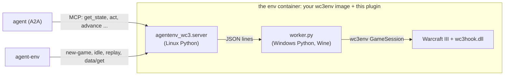

# Warcraft III for AgentEnv

An LLM agent plays a melee game of Warcraft III: The Frozen Throne against the game's own AI, through raw
[wc3env](https://github.com/pwang724/wc3env) orders served as MCP tools. Games are graded and their native
replays saved. This repository is an environment plugin for the [AgentEnv Framework](https://www.agentenvframework.com).

> **Unofficial, offline, and bring your own game.** This project is not affiliated with or endorsed by Blizzard
> Entertainment; Warcraft is their trademark. It contains no game files: wc3env runs your own licensed Warcraft III
> Legacy (1.29.2) installation, offline only, never on Battle.net. The env image you build holds your game files:
> keep it private. Whether this use fits your license agreement is your responsibility.

**Status: first milestone.** One agent against the built-in AI. Everything below the game is tested against
wc3env's fake game: the unit tests (`tests/`), and the image and a whole `agent-env run wc3 --task smoke` on a
stand-in for wc3env's image (`scripts/standin.sh`, in CI). The real game has not yet been run through this plugin.

## What it needs

- An **x86-64 Linux** Docker host whose kernel runs Wine (wc3env's `docker/platform_probe.py` checks it). Apple
  Silicon and arm64 hosts can't run it.
- **wc3env's worker image**, built from your own installation as its
  [docker/README.md](https://github.com/pwang724/wc3env/blob/main/docker/README.md) describes. That needs a Windows
  machine once, for the game hook and the prepared data, then any Linux builder:
  `docker build --platform linux/amd64 --target environment -t wc3-worker:local build/docker-context`.
- Your **activation files**, `roc.w3k` and `tft.w3k`, from the same installation, in `~/.wc3-license` (or the
  directory `license_dir` names in `[plugins.agentenv-wc3]` of `.agentenv/config.toml`, or `$WC3_LICENSE_DIR`).
  They never enter an image: the `wc3_match` step sends them to the env when a game starts.

## Run it

```bash
uv tool install agentenv-framework --with-editable ./agentenv-wc3-plugin
cd agentenv-wc3-plugin
agent-env wc3 check                      # the host, your wc3env image, your activation files
agent-env wc3 setup                      # build the env on top of wc3-worker:local and register it as "wc3"
agent-env run wc3 --task smoke           # no model: a 2-minute game runs with no orders, is graded and replayed
agent-env run wc3 --task vs-ai-quick     # your default agent against the easy AI, 5 game minutes
```

`agent-env wc3 serve` serves the env on this machine against wc3env's **fake game** (a Town Hall, five Peasants
and a distant enemy hall), to try the tools or an agent without Warcraft III.

| Task | Who plays | Game |
|---|---|---|
| `smoke` | nobody: the harness lets the game run | 2 minutes, Echo Isles |
| `vs-ai-quick` | your default agent, Human | 5 minutes against the easy Orc AI |
| `vs-ai` | your default agent, Human | 20 minutes against the normal Orc AI |

## How it works



wc3env holds the game's clock, so **time passes only when the agent calls `advance`**: an agent may think as long as
it likes between steps. Orders given with `act` are checked against wc3env's own rules (the unit is yours, the target
is in view, the arguments are well formed) and wait in a queue; `advance` sends them with the step and reports what
the game refused, the sites it chose for buildings, and what happened.

| Tool | What it does |
|---|---|
| `get_state` | Game time and limit, gold, lumber, food, units by type, idle workers, every structure and its production, enemies in view, nearby gold mines, start locations, the last step's events |
| `list_units` | One line per unit (yours, enemies, neutrals, or yours inside mines and buildings): id, type, position, hp, order; `details` adds what each can train, build, research and cast |
| `resources` | Gold mines, the nearest trees and items on the ground |
| `lookup` | Any unit, building, upgrade, item or ability: cost, time, stats, requirements, what it trains or researches, cast orders |
| `act` | Queue raw wc3env orders: `move`, `attack`, `smart`, `harvest`, `build`, `train`, `research`, `learn`, `cast`, `use_item`, `drop_item`, `buy`, `revive`, `stop`, `select`. Types, abilities and cast orders may be named (`"Footman"`, `"Blizzard"`) |
| `advance` | Send the queue and play 1-60 game seconds |

| AgentEnv piece | Here |
|---|---|
| Environment | `src/agentenv_wc3/server.py`: six tools, `data/get` (result, both sides' score counters, the harness's counters), and the extensions `urn:wc3:new-game/v1`, `urn:wc3:idle/v1` and `urn:wc3:replay/v1` |
| Task steps | `wc3_match` (starts the game, sends the activation files) and `save_wc3_replay`, in `steps.py` |
| Tasks and verifiers | `src/agentenv_wc3/bundles/wc3/` |
| CLI | `agent-env wc3 check`, `setup`, `serve` |

[docs/protocol.md](docs/protocol.md) is the worker's protocol.

## Not done yet

- **A run against the real game.** The worker drives wc3env's `GameSession` as wc3env's own tests and Docker
  smoke do, but this plugin has only met the fake game. The first `smoke` run on a real setup is the test.
- **Container options.** wc3env runs its worker with `--shm-size 256m` and `--init`; agent-env's `server`
  provider sets neither, and whether Wine needs them here is untested.
- **Several agents in one game**, seats and a turn barrier, as the OpenCiv3 plugin has.
- **Video and streaming**: the game draws to Xvfb inside the container; recording it, or a replay played back, is
  the next step after a working game.
- **A Linux-only build of wc3env's inputs**, so no Windows machine is needed (the hook with MinGW, StormLib on
  Linux).

## Development

`scripts/standin.sh path/to/wc3env` builds `wc3-worker:standin`, wc3env's image layout on its fake game, so
`agent-env wc3 setup --base wc3-worker:standin` and `agent-env run wc3 --task smoke` run anywhere with Docker.

`scripts/ci.yml` is the CI workflow (the tests, and the image and `smoke` on the stand-in); copy it to `.github/workflows/` to turn it on.

```bash
uv venv && uv pip install -e ".[dev]" -e path/to/wc3env   # wc3env from a checkout: tests use its fake game
.venv/bin/pytest
.venv/bin/ruff check .
```
